# Authors API Testing

TC-RETAUTH-A001: Retrieve All Authors

## **TC-RETAUTH-A001: Retrieve All Authors**

**Description:  
** Verify that the Authors API retrieves all available author records through GET /authors.

**Key Functionalities:**

- Retrieve all available authors.

- Return stored author information in JSON format.

- Return the appropriate HTTP status code.

**Expected Result:  
** The API should return 200 OK with a JSON array matching the prepared author collection.

**Actual Result:  
** The API returned 200 OK and retrieved the available authors in a JSON array. The returned records matched the expected author information

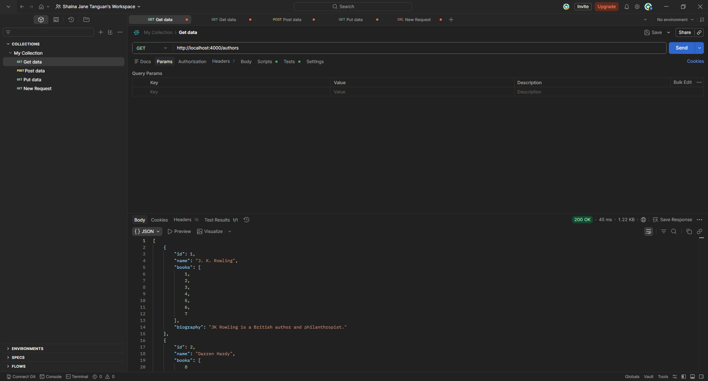

**Status:** PASS

TC-CREATEAUTH-A002: Create Author Using Valid Data

## **TC-CREATEAUTH-A002: Create Author Using Valid Data**

**Description:  
** Verify that valid author information creates a new author through POST /authors and that the author can subsequently be retrieved.

**Key Functionalities:**

- Accept valid author information.

- Generate an author ID.

- Return the created author details.

- Save the record for subsequent retrieval.

**Expected Result:  
** The POST request should return 201 Created with a generated ID and the submitted author information. A subsequent GET should return 200 OK with matching details.

**Actual Result:  
** The API returned 201 Created and created the author with a generated ID. The returned information matched the submitted data. Subsequent retrieval returned 200 OK with the same author details.

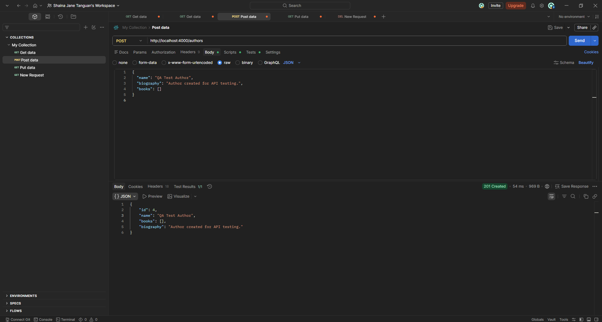

**Status:** PASS

TC-CREATEAUTH-A003: Create Author With Missing Na…

## **TC-CREATEAUTH-A003: Create Author With Missing Name**

**Description:  
** Verify that the Authors API rejects a creation request when the required name field is omitted from POST /authors.

**Key Functionalities:**

- Validate the presence of the author name.

- Reject incomplete creation requests.

- Return an appropriate validation error.

- Prevent creation of an incomplete author record.

**Expected Result:  
** The API should return 400 Bad Request with a validation error identifying the missing author name. No author should be created.

**Actual Result:  
** The API returned 400 Bad Request and rejected the request because the author name was missing. A validation error was returned, and no new author was created.

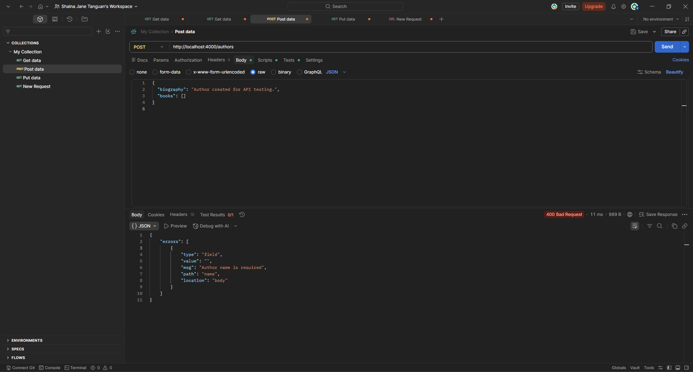

**Status:** PASS

TC-RETAUTH-A004: Retrieve Existing Author by ID

## **TC-RETAUTH-A004: Retrieve Existing Author by ID**

**Description:  
** Verify that an existing author can be retrieved using a valid ID through GET /authors/{id}.

**Key Functionalities:**

- Retrieve an author using an existing ID.

- Return the correct stored author information.

- Return the appropriate HTTP status code.

**Expected Result:  
** The API should return 200 OK with an author object containing the requested ID and the correct stored information.

**Actual Result:  
** The API returned 200 OK and retrieved the requested author. The returned ID and author details matched the expected record.

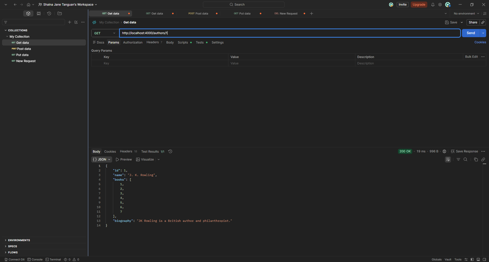

**Status:** PASS

TC-RETAUTH-A005: Retrieve Nonexistent Author

## **TC-RETAUTH-A005: Retrieve Nonexistent Author**

**Description:  
** Verify that the Authors API handles retrieval requests for an author ID that does not exist through GET /authors/{id}.

**Key Functionalities:**

- Check whether the requested author exists.

- Return an appropriate not-found response.

- Avoid returning an unrelated author record.

**Expected Result:  
** The API should return 404 Not Found with an error indicating that the requested author does not exist. No author record should be returned.

**Actual Result:  
** The API returned 404 Not Found and indicated that the requested author did not exist. No author record was returned.

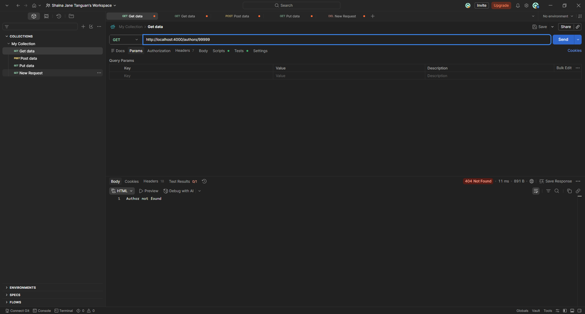

**Status:** PASS

TC-UPDAUTH-A006: Update Existing Author Using Val…

## **TC-UPDAUTH-A006: Update Existing Author Using Valid Data**

**Description:  
** Verify that valid information updates an existing author through PUT /authors/{id} and that the changes are saved.

**Key Functionalities:**

- Accept valid author updates.

- Retain the existing author ID.

- Return the updated author information.

- Save changes for subsequent retrieval.

**Expected Result:  
** The API should return 200 OK with the same author ID and the submitted updated information. A subsequent GET should confirm that the changes were saved.

**Actual Result:  
** The API returned 200 OK and updated the author information while retaining the same ID. Subsequent retrieval confirmed that the updated name, biography, and books array were saved.

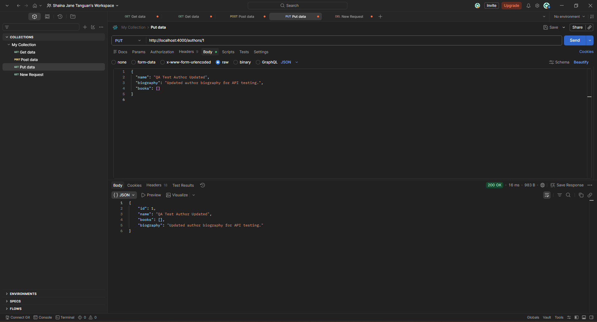

**Status:** PASS

TC-UPDAUTH-A007: Update Author With Invalid Books…

## **TC-UPDAUTH-A007: Update Author With Invalid Books Format**

**Description:  
** Verify that the Authors API rejects an update when books is supplied as a string instead of an array through PUT /authors/{id}.

**Key Functionalities:**

- Validate that books is an array.

- Reject invalid field types.

- Return an appropriate validation error and HTTP status code.

- Preserve the existing author information when validation fails.

**Expected Result:  
** The API should return 400 Bad Request with a validation error indicating that books must be an array. The stored author record should remain unchanged.

**Actual Result:  
** The API returned 200 OK for author ID 1. The response contained "books": "NOT-AN-ARRAY" instead of an array, and no validation error was returned.

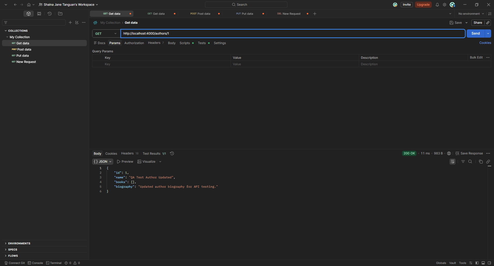

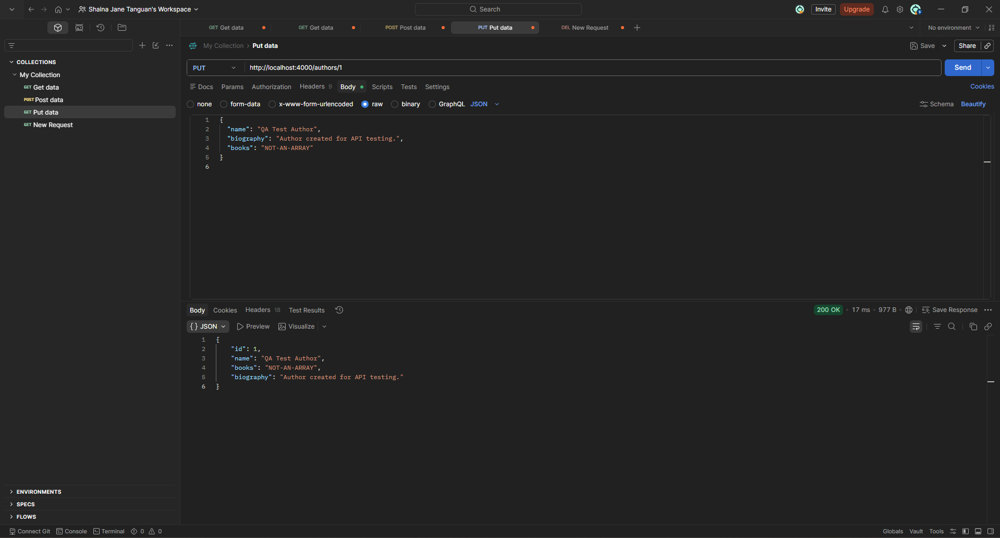

**Status:** FAIL

TC-DELAUTH-A008: Delete Existing Author

## **TC-DELAUTH-A008: Delete Existing Author**

**Description:  
** Verify that an existing author can be deleted through DELETE /authors/{id} and is no longer retrievable afterward.

**Key Functionalities:**

- Delete the specified author record.

- Return the appropriate HTTP status code.

- Confirm that the deleted author is no longer available.

**Expected Result:  
** The DELETE request should return 200 OK. A subsequent GET for the same ID should return 404 Not Found.

**Actual Result:  
** The API returned 200 OK for the deletion request. Subsequent retrieval of the same author ID returned 404 Not Found, confirming that the author was removed.

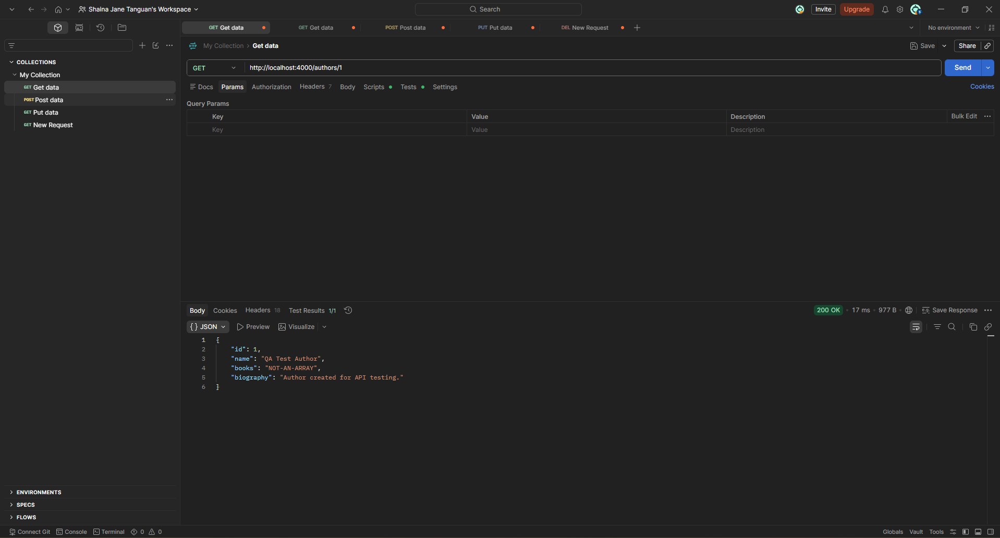

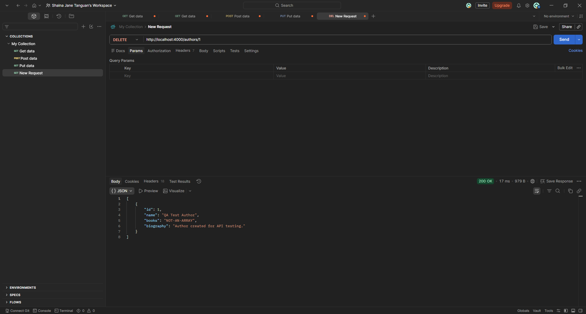

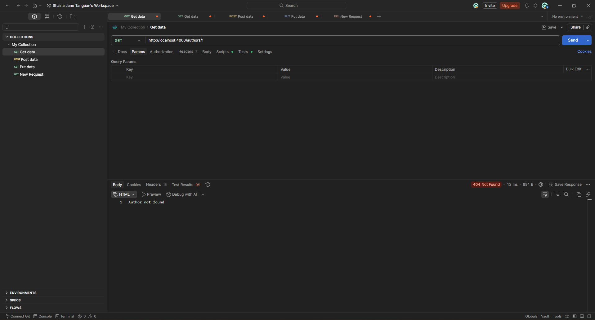

**Status:** PASS

TC-DELAUTH-A009: Delete Nonexistent Author

## **TC-DELAUTH-A009: Delete Nonexistent Author**

**Description:  
** Verify that deleting a nonexistent author through DELETE /authors/{id} returns a not-found response without affecting existing records.

**Key Functionalities:**

- Check whether the target author exists.

- Reject deletion of a nonexistent author.

- Return an appropriate not-found response.

- Preserve other author records.

**Expected Result:  
** The API should return 404 Not Found. Existing author records should remain unchanged.

**Actual Result:  
** The API returned 404 Not Found for the nonexistent author ID. Existing author records were not removed or changed.

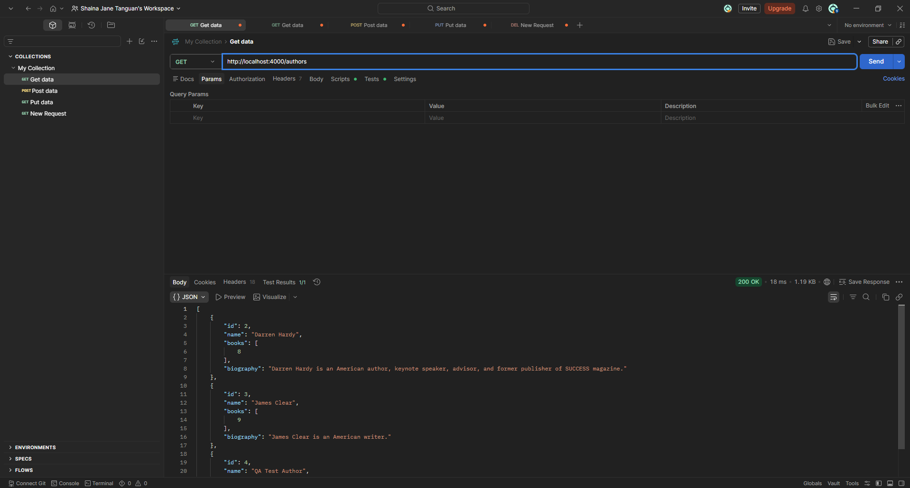

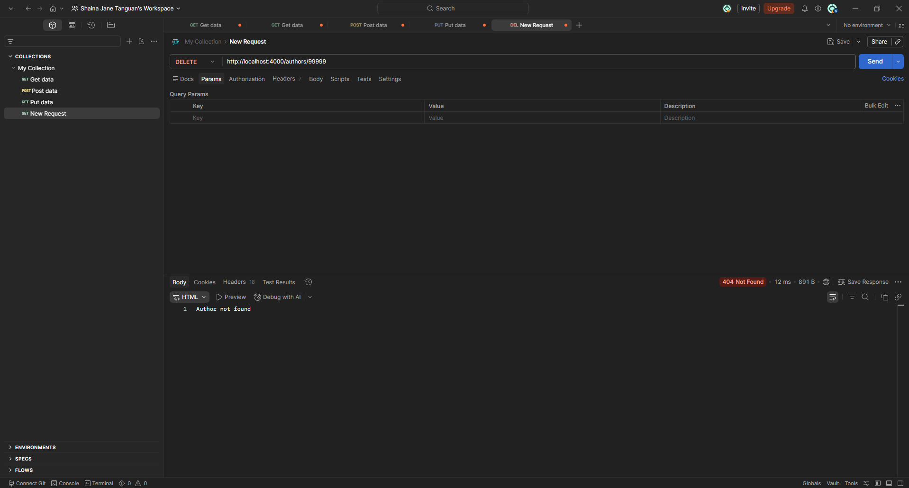

**Status:** PASS

TC-UPDAUTH-A010: Update Nonexistent Author

## **TC-UPDAUTH-A010: Update Nonexistent Author**

**Description:  
** Verify that an update targeting a nonexistent author through PUT /authors/{id} is rejected without creating or changing records.

**Key Functionalities:**

- Check whether the target author exists.

- Reject updates to nonexistent authors.

- Return an appropriate not-found response.

- Prevent unintended creation or modification of records.

**Expected Result:  
** The API should return 404 Not Found. No author should be created for the nonexistent ID, and existing records should remain unchanged.

**Actual Result:  
** The API returned 404 Not Found and rejected the update targeting the nonexistent author. No author was created, and existing records remained unchanged.

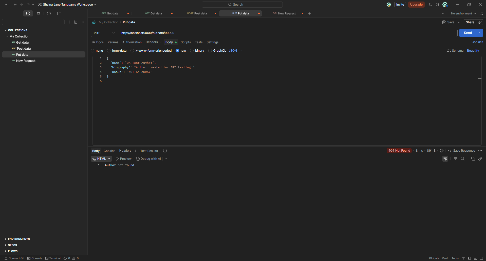

**Status:** PASS

TC-CREATEAUTH-A011: Create Author With Invalid Bo…

## **TC-CREATEAUTH-A011: Create Author With Invalid Books Format**

**Description:  
** Verify that the Authors API rejects a creation request when books is supplied as a string instead of an array through POST /authors.

**Key Functionalities:**

- Validate the data type of books.

- Reject creation requests containing an invalid books format.

- Return an appropriate validation error.

- Prevent creation of an invalid author record.

**Expected Result:  
** The API should return 400 Bad Request with a validation error indicating that books must be an array. No author should be created.

**Actual Result:  
** The API returned 400 Bad Request and rejected the string value supplied for books. A validation error was returned, and no new author was created.

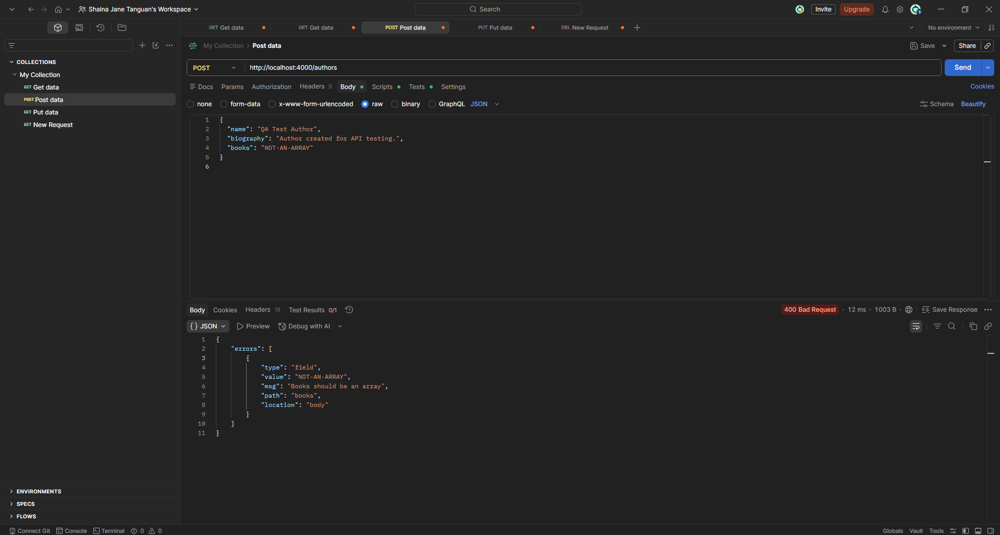

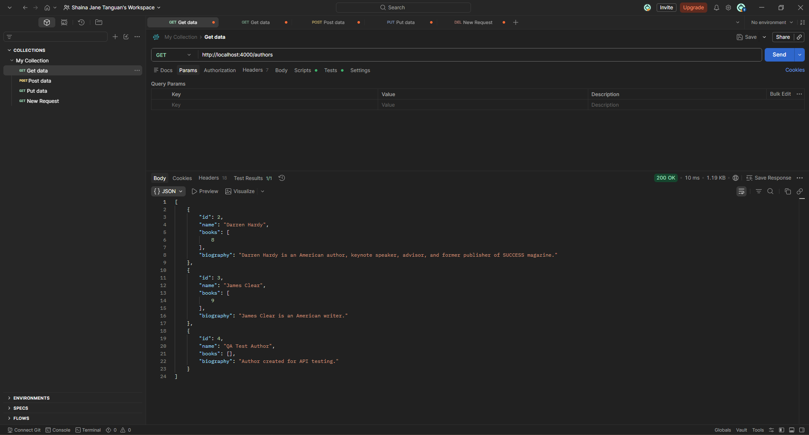

**Status:** PASS

TC-UPDAUTH-A012: Update Author With Missing Name

## **TC-UPDAUTH-A012: Update Author With Missing Name**

**Description:  
** Verify that the Authors API rejects an update when the required name field is omitted from PUT /authors/{id}.

**Key Functionalities:**

- Validate the presence of the required author name.

- Reject incomplete update requests.

- Return an appropriate validation error.

- Preserve the original author information.

**Expected Result:  
** The API should return 400 Bad Request with an error indicating that the author name is required. The existing name, biography, and books values should remain unchanged.

**Actual Result:  
** The API returned 400 Bad Request and rejected the update because the author name was missing. The existing author information remained unchanged.

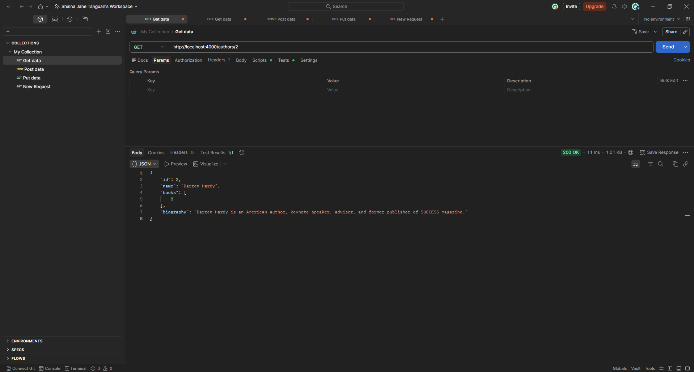

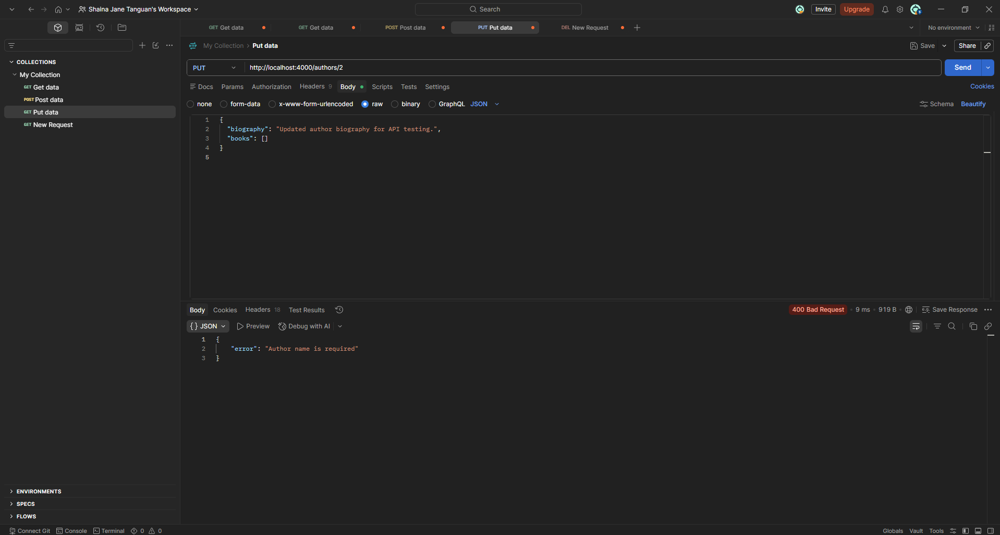

**Status:** PASS
