# Books API Testing

TC-RETBOOKS-B001 – Retrieve All Books

### **TC-RETBOOKS-B001 – Retrieve All Books**

**Description:  
**Verify that the Books API successfully retrieves all available book records through the GET /books endpoint.

**Key Functionalities:**

- Retrieve all book records.

- Return book information in JSON format.

- Return the appropriate HTTP status code.

- Display the expected book fields.

**Expected Result:  
**The API should return 200 OK and provide the available books in JSON format with the expected book information.

**Actual Result:  
**The API returned 200 OK and successfully retrieved the available book records in JSON format.

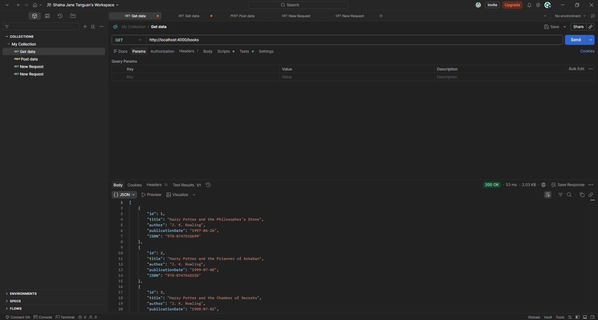

**Status:** **Passed**

TC-CREATEBOOK-B002 – Create Book Using Valid Data

### **TC-CREATEBOOK-B002 – Create Book Using Valid Data**

**Description**:  
Verify that a new book can be successfully created through the POST /books endpoint when valid book information is provided.

**Key Functionalities:**

- Create a new book record.

- Accept valid book information.

- Generate a new book ID.

- Return the created book information.

- Return the appropriate HTTP status code.

**Expected Result:**  
The API should return 201 Created and create a new book using the provided valid information.

**Actual Result:  
**The API returned 201 Created and successfully created the book Software Testing Fundamentals with the generated ID 10.

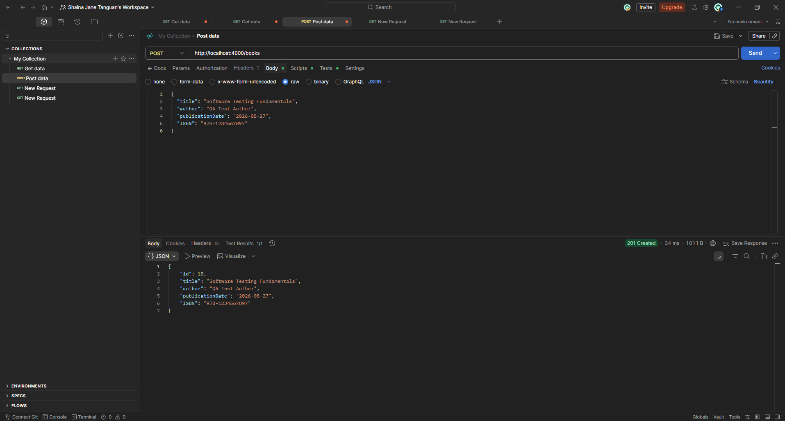

Status: PASS

TC-CREATEBOOK-B003 – Create Book With Empty Reque…

### **TC-CREATEBOOK-B003 – Create Book With Empty Request Body**

**Description:  
**Verify that the Books API rejects a book creation request when an empty JSON request body is submitted.

**Key Functionalities:**

- Validate required book fields.

- Reject incomplete requests.

- Return appropriate validation messages.

- Return the appropriate HTTP status code.

**Expected Result:  
**The API should return 400 Bad Request and provide validation errors for the missing or invalid required book fields.

**Actual Result:  
**The API returned 400 Bad Request and provided validation errors for title, author, publicationDate, and ISBN.

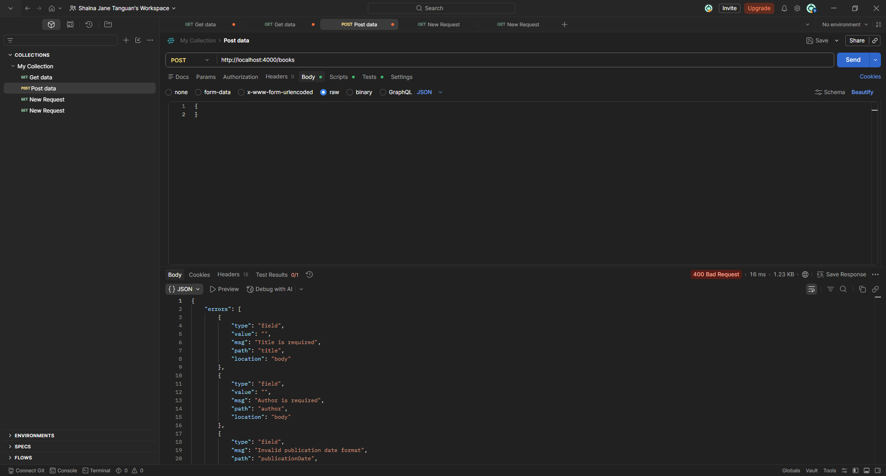

**Status:** **PASS**

TC-CREATEBOOK-B004 – Create Book With Missing ISBN

### **TC-CREATEBOOK-B004 – Create Book With Missing ISBN**

**Description:  
**Verify that the Books API rejects a book creation request when the ISBN field is omitted.

**Key Functionalities:**

- Validate ISBN input.

- Detect missing ISBN information.

- Prevent creation of an invalid book record.

- Return an appropriate validation response.

**Expected Result:  
**The API should return 400 Bad Request and indicate that the ISBN information is invalid or missing.

**Actual Result:  
**The API returned 400 Bad Request with the validation message Invalid ISBN format.

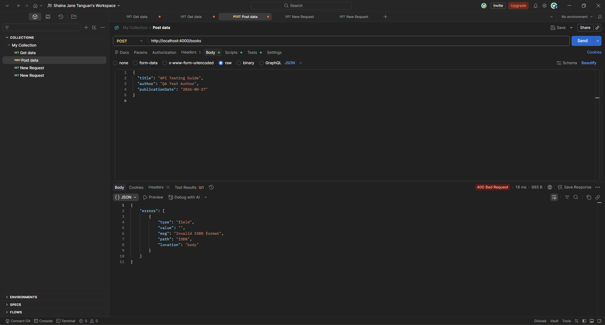

**Status:** **PASS**

TC-RETBOOK-B005 – Retrieve Existing Book by ID

### **TC-RETBOOK-B005 – Retrieve Existing Book by ID**

**Description:  
**Verify that an existing book can be retrieved using its valid book ID.

**Key Functionalities:**

- Retrieve an individual book.

- Search using a valid book ID.

- Return the correct book information.

- Return the appropriate HTTP status code.

**Expected Result:  
**The API should return 200 OK and provide the book associated with the requested ID.

**Actual Result:  
**The API returned 200 OK and successfully retrieved book ID 10 with the expected book information.

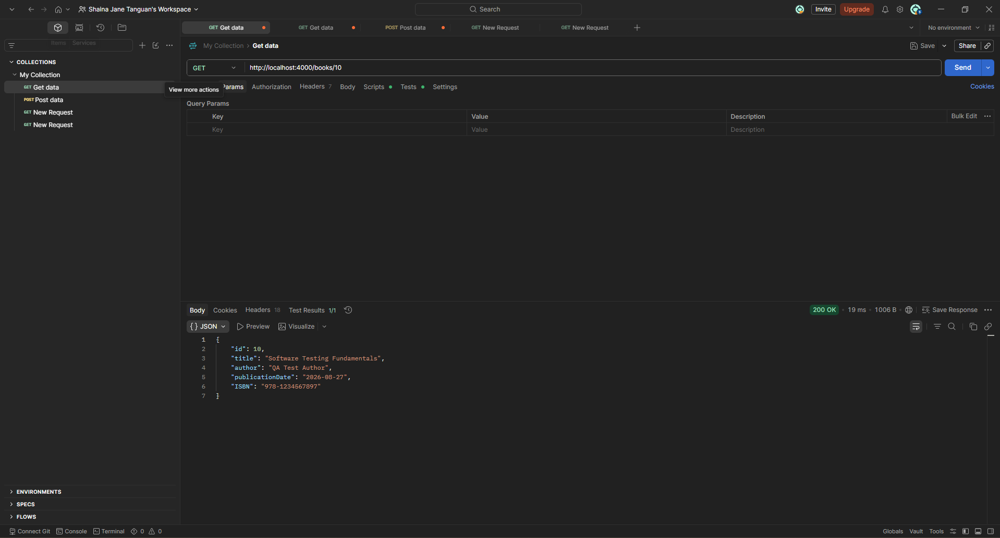

**Status:** **PASS**

TC-RETBOOK-B006 – Retrieve Nonexistent Book

## **TC-RETBOOK-B006: Retrieve Book Using Nonexistent ID**

**Description:  
**Verify that the Books API properly handles a request for a book ID that does not exist.

**Key Functionalities:**

- Detect nonexistent book IDs.

- Prevent unrelated book data from being returned.

- Return an appropriate not-found response.

**Expected Result:  
**The API should return 404 Not Found and indicate that the requested book does not exist.

**Actual Result:  
**The API returned 404 Not Found with the response Booknotfound.

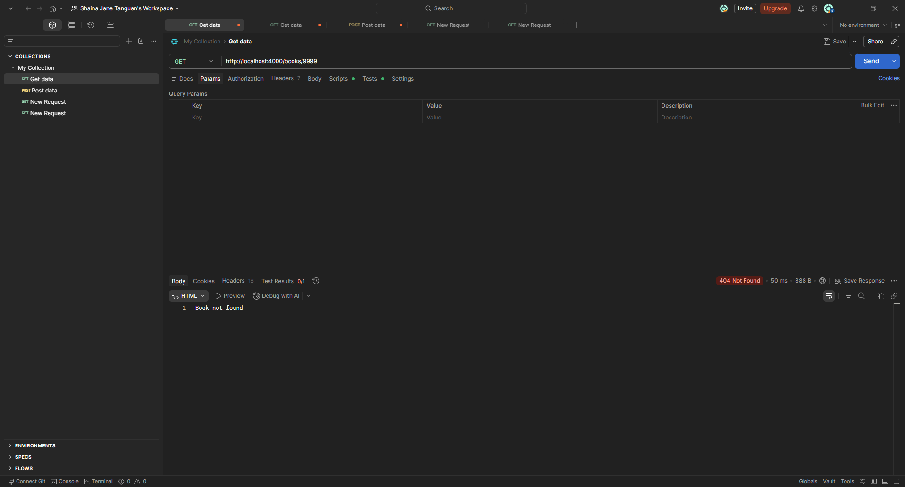

**Status:** **PASS**

TC-UPDBOOK-B007 – Update Existing Book Using Vali…

### **TC-UPDBOOK-B007 – Update Existing Book Using Valid Data**

**Description:  
**Verify that an existing book can be successfully updated when valid book information is provided.

**Key Functionalities:**

- Update an existing book record.

- Accept valid updated information.

- Preserve the correct book ID.

- Return the updated information.

**Expected Result:  
**The API should return 200 OK and update the requested book with the provided valid information.

**Actual Result:  
**The API returned 200 OK and successfully updated book ID 10 to Advanced Software Testing.

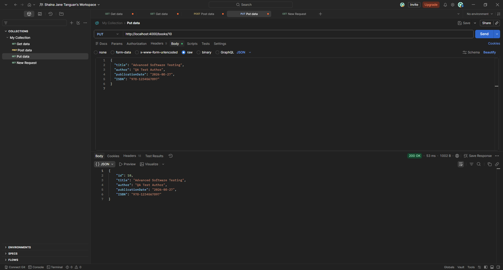

**Status:** **PASS**

TC-UPDBOOK-B008 – Update Book Using Invalid ISBN

### **TC-UPDBOOK-B008 – Update Book Using Invalid ISBN**

**Description:  
**Verify that the Books API rejects invalid ISBN information when updating an existing book.

**Key Functionalities:**

- Validate ISBN during book updates.

- Reject invalid book information.

- Prevent invalid information from being stored.

- Maintain consistent validation between create and update operations.

**Expected Result:  
**The API should reject "ISBN": "INVALID-ISBN" and return an appropriate validation response such as 400 Bad Request. The invalid value should not be stored.

**Actual Result:  
**The API returned 200 OK and accepted "ISBN": "INVALID-ISBN". A subsequent retrieval confirmed that the invalid ISBN was stored in book ID 10.

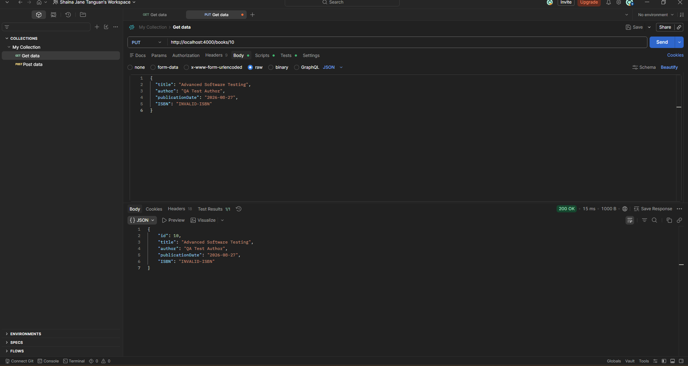

*.*

**Status:** **FAIL**

TC-DELBOOK-B009: Delete Existing Book

## **TC-DELBOOK-B009: Delete Existing Book**

**Description:  
**Verify that an existing book can be successfully deleted using its valid ID.

**Key Functionalities:**

- Delete an existing book.

- Remove the correct book record.

- Return a successful HTTP response.

- Ensure the deleted book can no longer be retrieved.

**Expected Result:  
**The API should successfully delete book ID 10. A subsequent retrieval of the same ID should return 404 Not Found.

**Actual Result:  
**The API returned 200 OK for the delete request. A subsequent GET /books/10 request returned 404 Not Found, confirming that the book was removed.

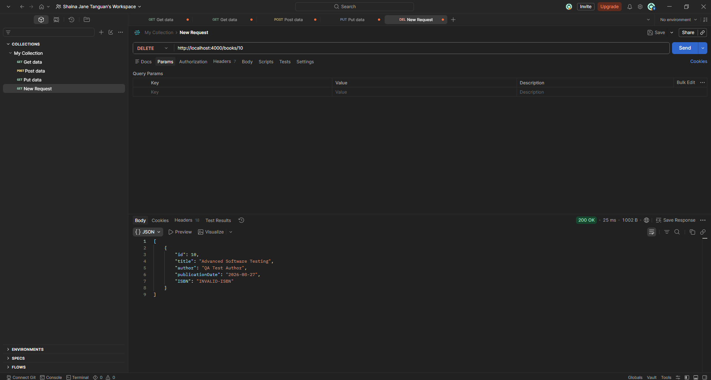

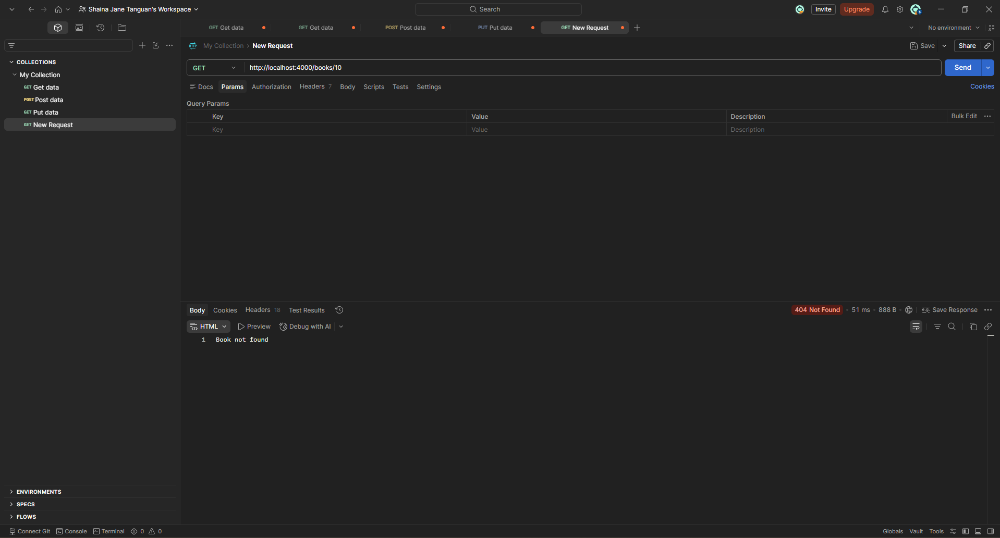

**Status:** **PASS**

TC-DELBOOK-B011 – Delete Nonexistent Book

### **TC-DELBOOK-B010 – Delete Nonexistent Book**

**Description:  
**Verify that the Books API properly handles a deletion request for a book ID that does not exist.

**Key Functionalities:**

- Detect nonexistent book IDs.

- Prevent unintended deletion.

- Return an appropriate not-found response.

**Expected Result:  
**The API should return 404 Not Found and indicate that the requested book does not exist.

**Actual Result:  
**The API returned 404 Not Found with the response Booknotfound.

**Status:** **PASS**

TC-UPDBOOK-B011: Update Nonexistent Book

## **TC-UPDBOOK-B011: Update Nonexistent Book**

**Description:  
**Verify that the Books API properly handles an update request for a book that does not exist.

**Key Functionalities:**

- Detect nonexistent book IDs.

- Prevent creation or modification through an invalid update request.

- Return an appropriate not-found response.

**Expected Result:  
**The API should return 404 Not Found because book ID 99999 does not exist.

**Actual Result:  
**The API returned 404 Not Found with the response Booknotfound.

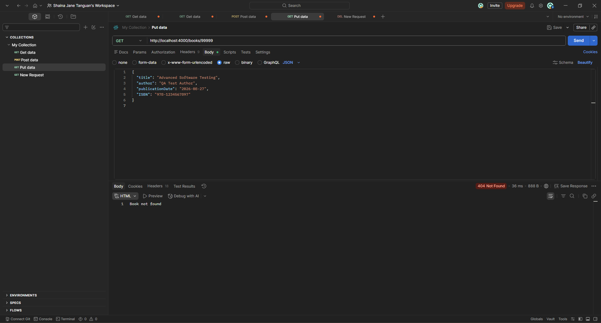

TC-CREATEBOOK-B012: Create Book With Invalid ISBN

## **TC-CREATEBOOK-B012: Create Book With Invalid ISBN**

**Description:  
** Verify that the Books API rejects a book creation request containing an invalid ISBN through the POST /books endpoint.

**Key Functionalities:**

- Validate the ISBN format.

- Reject book creation requests containing an invalid ISBN.

- Return an appropriate validation error and HTTP status code.

- Prevent the creation of an invalid book record.

**Expected Result:  
** The API should return 400 Bad Request with an ISBN validation error. The book should not be created.

**Actual Result:  
** The API rejected the book creation request containing an invalid ISBN and returned an ISBN validation error.

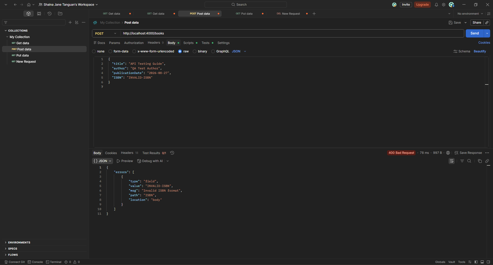

**Status:** PASS

TC-UPDBOOK-B013: Update Book With Missing ISBN

## **TC-UPDBOOK-B013: Update Book With Missing ISBN**

**Description:  
** Verify that the Books API rejects an update request when the required ISBN field is omitted through the PUT /books/{id} endpoint.

**Key Functionalities:**

- Validate the presence of the required ISBN field.

- Reject incomplete book update requests.

- Return an appropriate validation error and HTTP status code.

- Preserve the existing book information when validation fails.

**Expected Result:  
** The API should return 400 Bad Request with an error indicating missing required book information. The existing book record should remain unchanged.

**Actual Result:  
** The API rejected the update request with the ISBN field omitted and returned a validation error for incomplete book information.

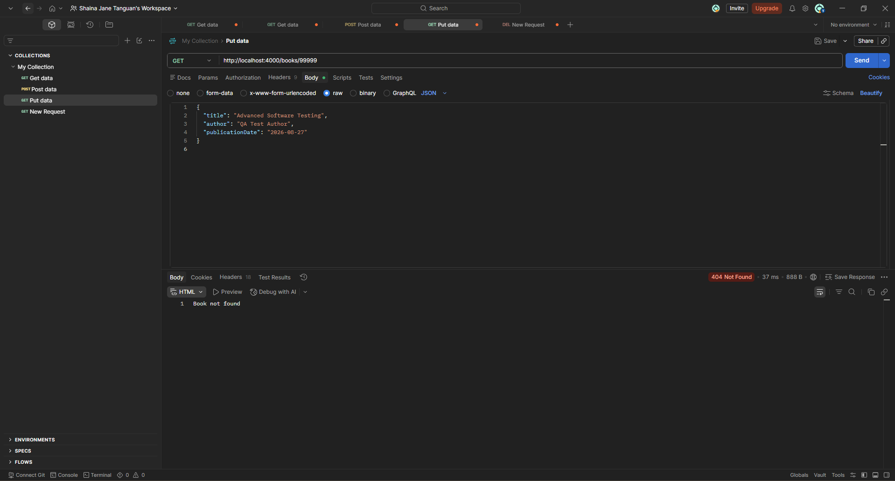

**Status:** PASS
