# Users API Testing

TC-RETUSER-U001: Retrieve All Users

## **TC-RETUSER-U001: Retrieve All Users**

**Description:  
** Verify that the Users API retrieves all available user records through GET /users.

**Key Functionalities:**

- Retrieve all available users.

- Return user information in JSON format.

- Return the appropriate HTTP status code.

**Expected Result:  
** The API should return 200 OK with a JSON array containing the expected user records and their stored information.

**Actual Result:  
** The API returned 200 OK and retrieved the available users in JSON format. The returned records matched the expected user information.

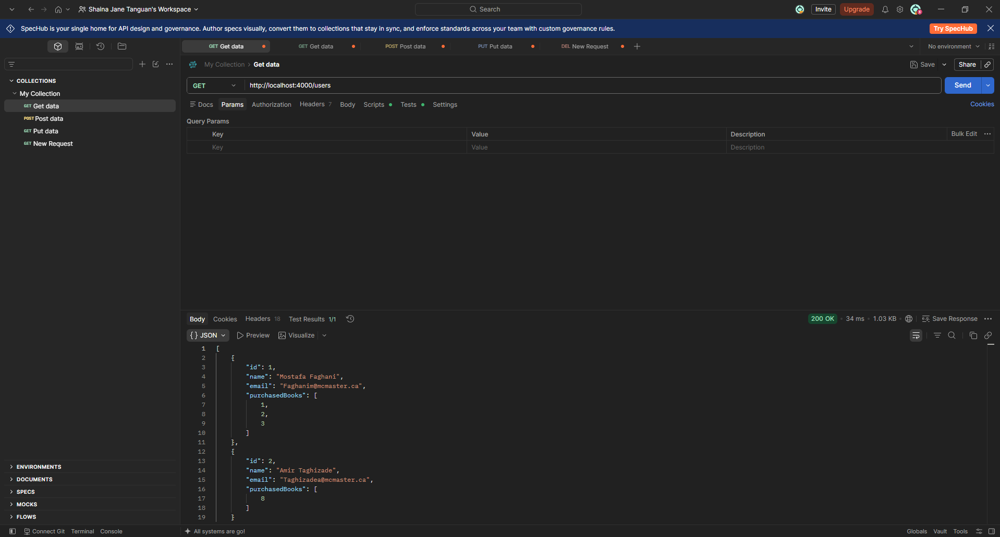

**Status:** PASS

TC-CREATEUSER-U002: Create User Using Valid Data

## **TC-CREATEUSER-U002: Create User Using Valid Data**

**Description:**

Verify that valid user information creates a new user through POST /users and that the user can subsequently be retrieved.

**Key Functionalities:**

- Accept valid user information.

- Generate a user ID.

- Return the created user details.

- Save the record for subsequent retrieval.

**Expected Result:  
** The API should return 201 Created with a generated ID and the submitted user information. Subsequent retrieval should return 200 OK with matching details.

**Actual Result:  
** The API returned 201 Created and created the user with a generated ID. The returned information matched the submitted data, and subsequent retrieval confirmed the saved user details.

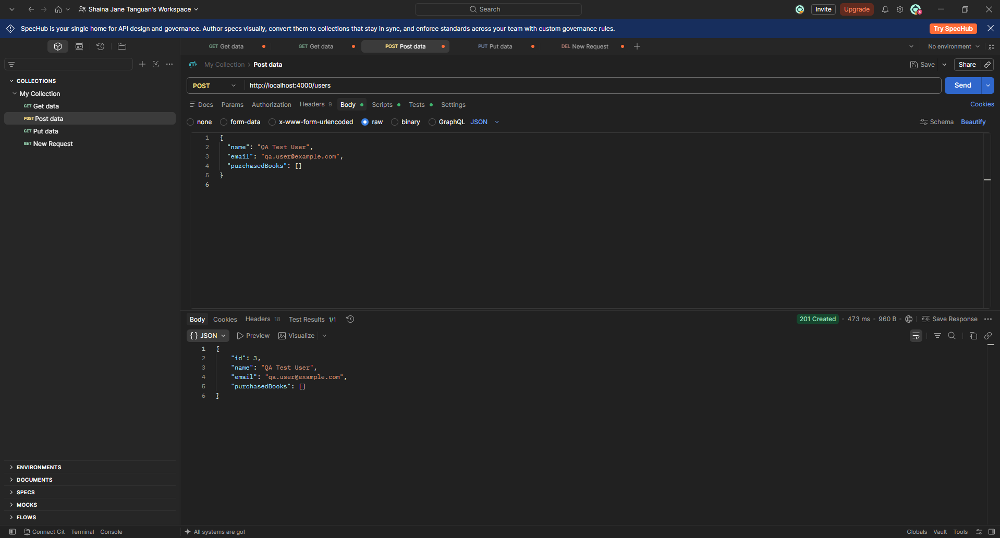

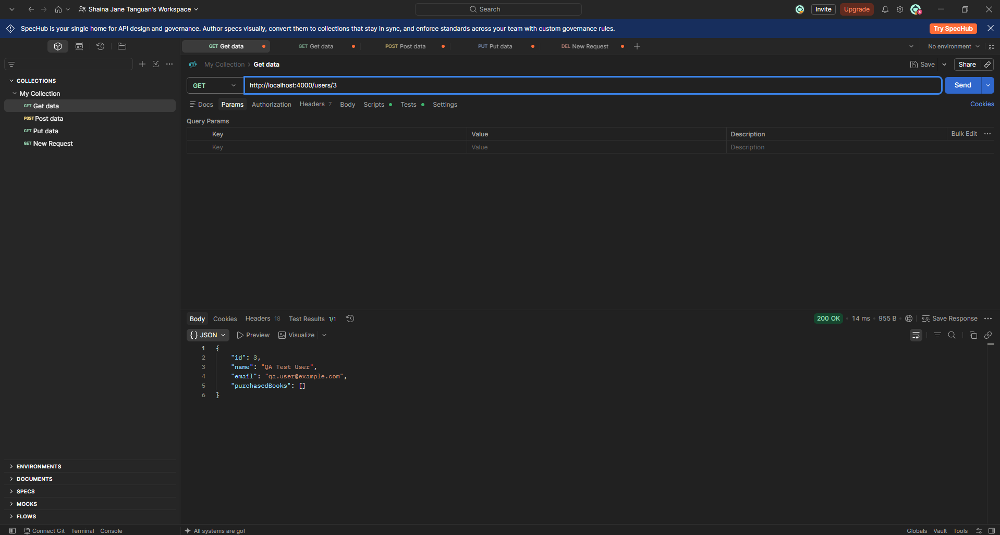

**Status:** PASS

TC-CREATEUSER-U003: Create User With Missing Name

## **TC-CREATEUSER-U003: Create User With Missing Name**

**Description:  
** Verify that the Users API rejects a creation request when the required name field is omitted from POST /users.

**Key Functionalities:**

- Validate the presence of the user name.

- Reject incomplete creation requests.

- Return an appropriate validation error.

- Prevent creation of an incomplete user record.

**Expected Result:  
** The API should return 400 Bad Request with a validation error identifying the missing name. No user should be created.

**Actual Result:  
** The API returned 400 Bad Request and rejected the request with the name omitted. A validation error was returned, and no new user was created.

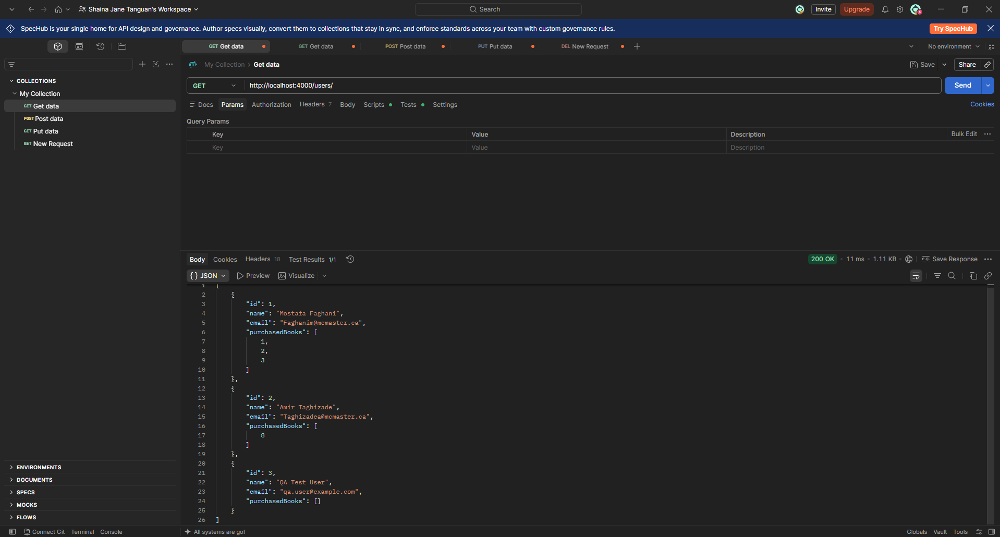

TC-CREATEUSER-U004: Create User With Invalid Email

## **TC-CREATEUSER-U004: Create User With Invalid Email**

**Description:  
** Verify that the Users API rejects a creation request containing an invalid email format through POST /users.

**Key Functionalities:**

- Validate the email format.

- Reject invalid email values.

- Return an appropriate validation error.

- Prevent creation of a user with invalid email information.

**Expected Result:  
** The API should return 400 Bad Request with an email validation error. No user should be created.

**Actual Result:  
** The API returned 400 Bad Request and rejected the creation request containing an invalid email address. An email validation error was returned, and no user was created.

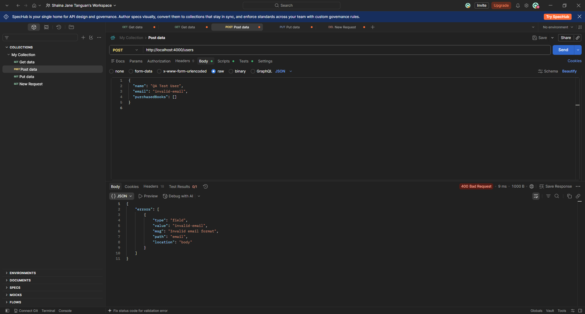

TC-UPDUSER-U005: Update Existing User Using Valid…

## **TC-UPDUSER-U005: Update Existing User Using Valid Data**

**Description:  
** Verify that valid information updates an existing user through PUT /users/{id} and that the changes are saved.

**Key Functionalities:**

- Accept valid user updates.

- Retain the existing user ID.

- Return the updated user information.

- Save changes for subsequent retrieval.

**Expected Result:  
** The API should return 200 OK with the same user ID and the submitted updated information. Subsequent retrieval should confirm that the changes were saved.

**Actual Result:  
** The API returned 200 OK and updated the user information while retaining the same ID. Subsequent retrieval confirmed that the updated details were saved.

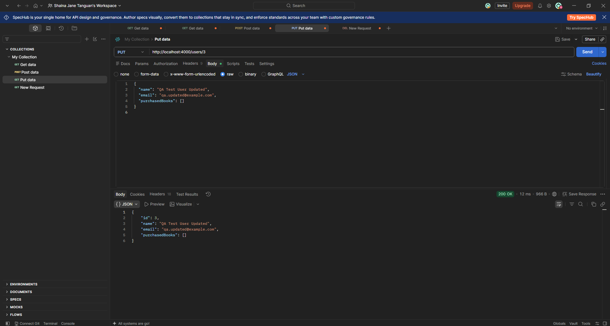

TC-DELUSER-U007: Delete Existing User

## **TC-DELUSER-U007: Delete Existing User**

**Description:  
** Verify that an existing user can be deleted through DELETE /users/{id} and is no longer retrievable afterward.

**Key Functionalities:**

- Delete the specified user record.

- Return the appropriate HTTP status code.

- Confirm that the deleted user is no longer available.

**Expected Result:  
** The DELETE request should return 200 OK. A subsequent GET for the same ID should return 404 Not Found.

**Actual Result:  
** The API returned 200 OK for the deletion request. Subsequent retrieval of the same user ID returned 404 Not Found, confirming that the user was removed.

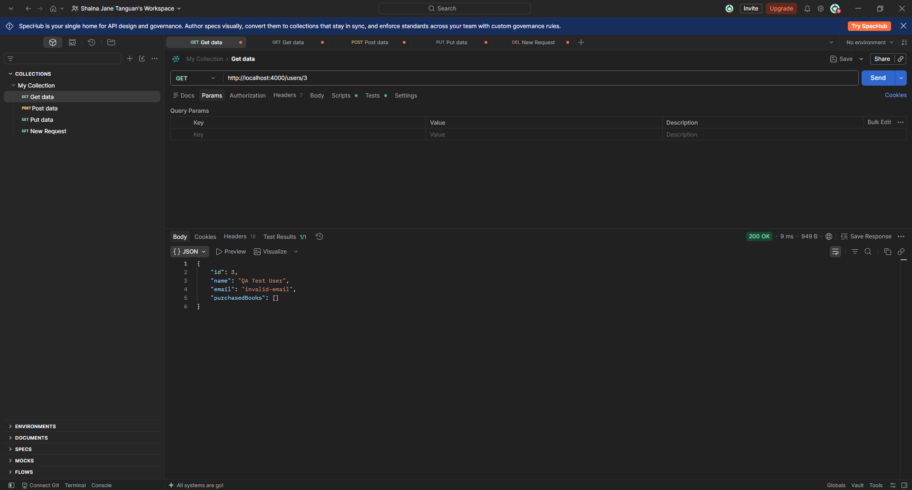

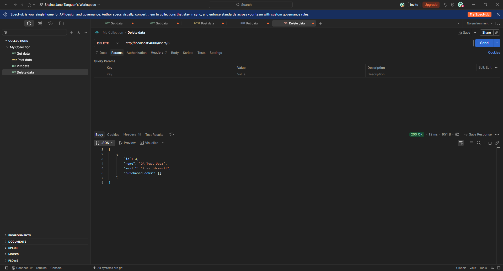

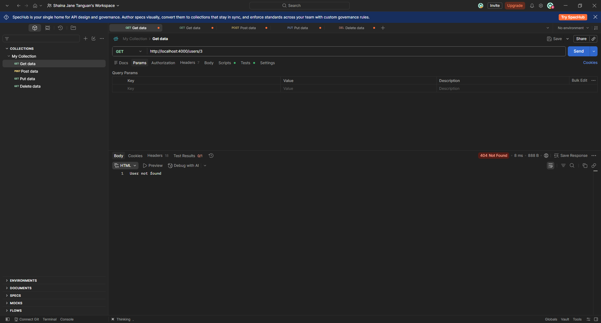

TC-DELUSER-U008: Delete Nonexistent User

## **TC-DELUSER-U008: Delete Nonexistent User**

**Description:  
** Verify that deleting a nonexistent user through DELETE /users/{id} returns a not-found response without affecting existing records.

**Key Functionalities:**

- Check whether the target user exists.

- Reject deletion of a nonexistent user.

- Return an appropriate not-found response.

- Preserve other user records.

**Expected Result:  
** The API should return 404 Not Found. Existing user records should remain unchanged.

**Actual Result:  
** The API returned 404 Not Found for the nonexistent user ID. Existing user records were not removed or changed.

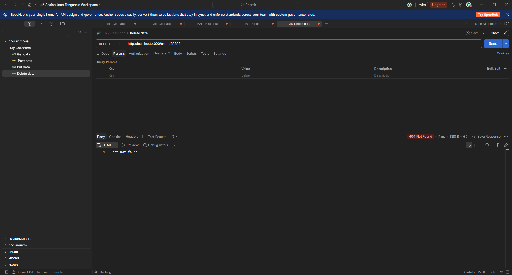

TC-RETUSER-U009: Retrieve Existing User by ID

## **TC-RETUSER-U009: Retrieve Existing User by ID**

**Description:  
** Verify that an existing user can be retrieved using a valid ID through GET /users/{id}.

**Key Functionalities:**

- Retrieve a user using an existing ID.

- Return the correct stored user information.

- Return the appropriate HTTP status code.

**Expected Result:  
** The API should return 200 OK with a user object containing the requested ID and the correct stored information.

**Actual Result:  
** The API returned 200 OK and retrieved the requested user. The returned ID and user information matched the expected record.

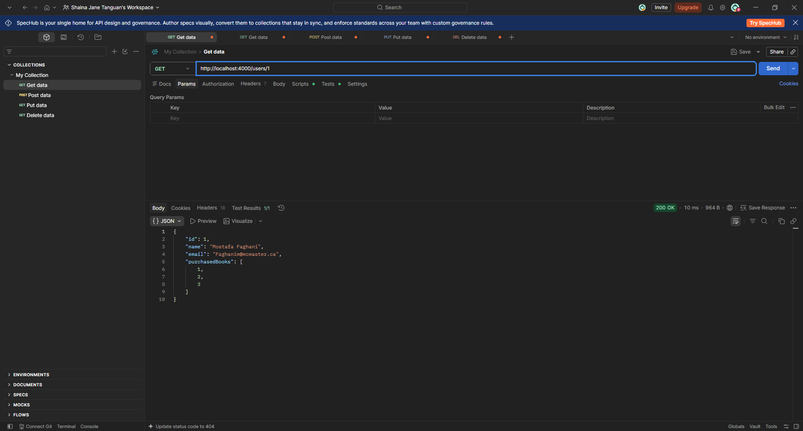

TC-RETUSER-U010: Retrieve Nonexistent User

## **TC-RETUSER-U010: Retrieve Nonexistent User**

**Description:  
** Verify that the Users API handles retrieval requests for a user ID that does not exist through GET /users/{id}.

**Key Functionalities:**

- Check whether the requested user exists.

- Return an appropriate not-found response.

- Avoid returning an unrelated user record.

**Expected Result:  
** The API should return 404 Not Found with an error indicating that the requested user does not exist. No user record should be returned.

**Actual Result:  
** The API returned 404 Not Found and indicated that the requested user did not exist. No user record was returned.

TC-UPDUSER-U011: Update Nonexistent User

## **TC-UPDUSER-U011: Update Nonexistent User**

**Description:  
** Verify that an update targeting a nonexistent user through PUT /users/{id} is rejected without creating or changing records.

**Key Functionalities:**

- Check whether the target user exists.

- Reject updates to nonexistent users.

- Return an appropriate not-found response.

- Prevent unintended creation or modification of records.

**Expected Result:  
** The API should return 404 Not Found. No user should be created for the nonexistent ID, and existing records should remain unchanged.

**Actual Result:  
** The API returned 404 Not Found and rejected the update targeting the nonexistent user. No user was created, and existing records remained unchanged.

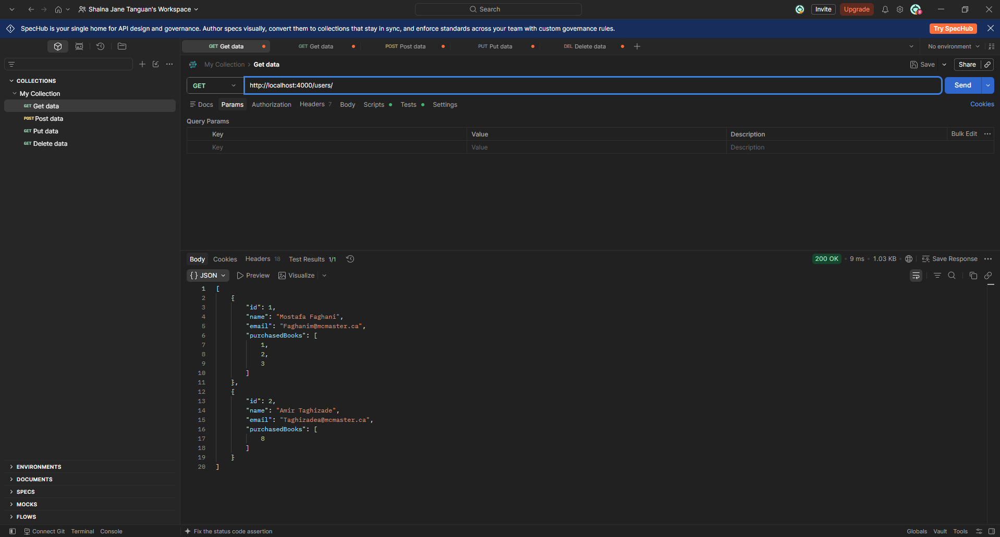

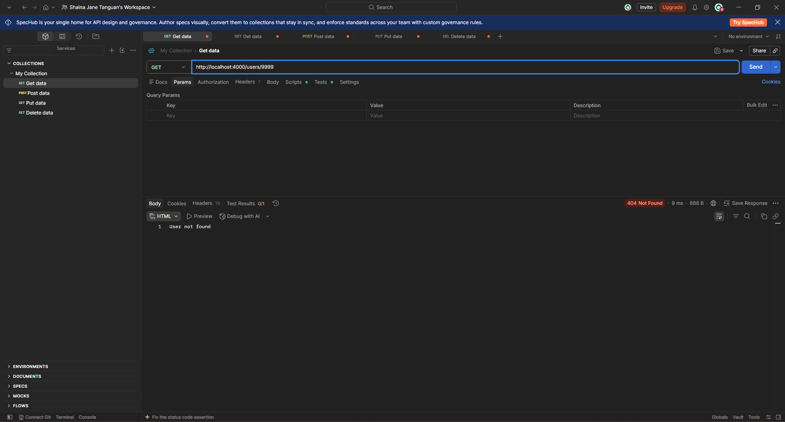

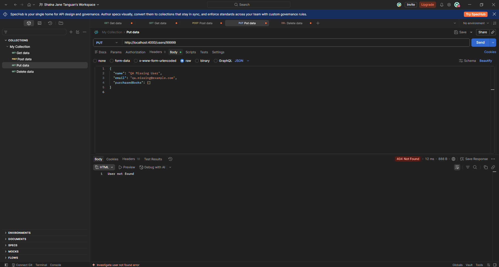

TC-UPDUSER-U012: Update User With Missing Email

## **TC-UPDUSER-U012: Update User With Missing Email**

**Description:  
** Verify that the Users API rejects an update when the required email field is omitted from PUT /users/{id}.

**Key Functionalities:**

- Validate the presence of the required email field.

- Reject incomplete update requests.

- Return an appropriate validation error.

- Preserve the original user information.

**Expected Result:  
** The API should return 400 Bad Request with an error indicating missing required email information. The existing user record should remain unchanged.

**Actual Result:  
** The API returned 400 Bad Request and rejected the update with the email field omitted. The existing user information remained unchanged.

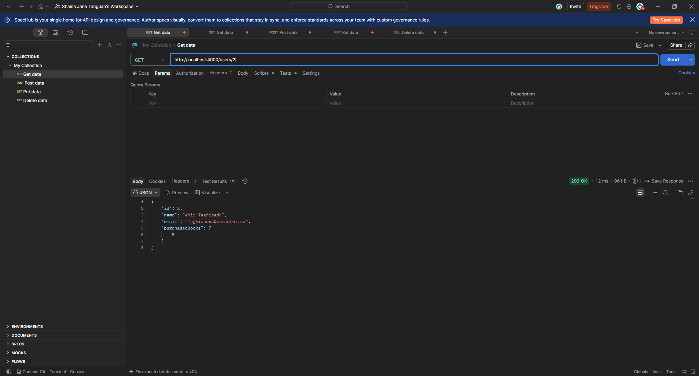

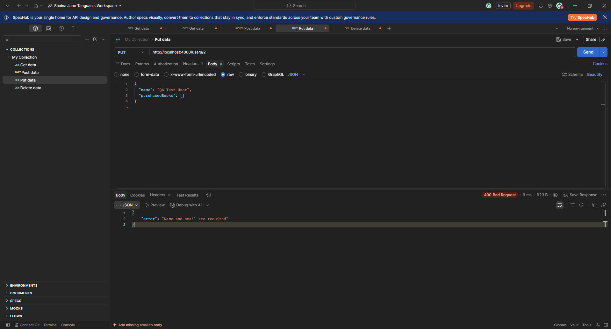

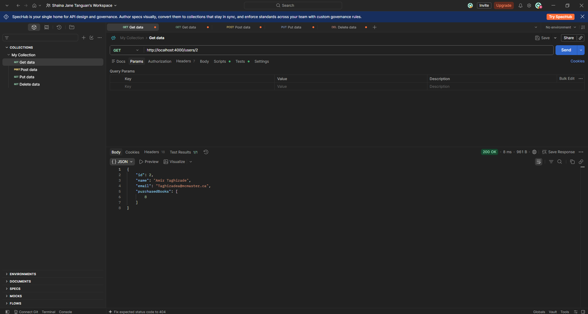

TC-CREATEUSER-U013: Create User With Missing Email

## **TC-CREATEUSER-U013: Create User With Missing Email**

**Description:  
** Verify that the Users API rejects a creation request when the required email field is omitted from POST /users.

**Key Functionalities:**

- Validate the presence of the required email field.

- Reject incomplete creation requests.

- Return an appropriate validation error.

- Prevent creation of an incomplete user record.

**Expected Result:  
** The API should return 400 Bad Request with an email validation error. No user should be created.

**Actual Result:  
** The API returned 400 Bad Request and rejected the creation request with the email field omitted. An email validation error was returned, and no new user was created.

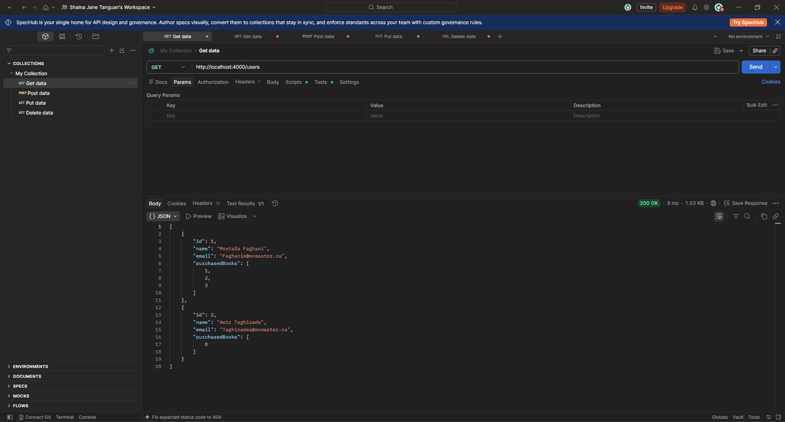

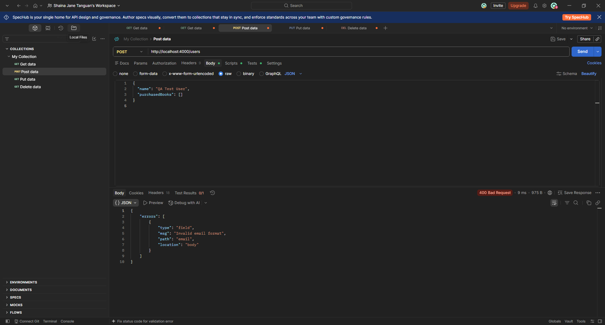

TC-UPDUSER-U014: Update User With Missing Name

## **TC-UPDUSER-U014: Update User With Missing Name**

**Description:  
** Verify that the Users API rejects an update when the required name field is omitted from PUT /users/{id}.

**Key Functionalities:**

- Validate the presence of the required user name.

- Reject incomplete update requests.

- Return an appropriate validation error.

- Preserve the original user information.

**Expected Result:  
** The API should return 400 Bad Request with an error indicating missing required name information. The existing user record should remain unchanged.

**Actual Result:  
** The API returned 400 Bad Request and rejected the update with the name field omitted. The existing user information remained unchanged.

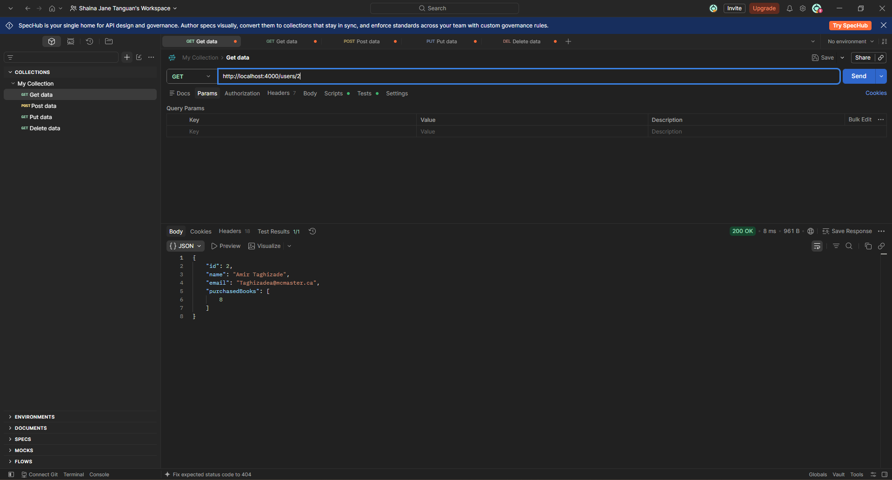

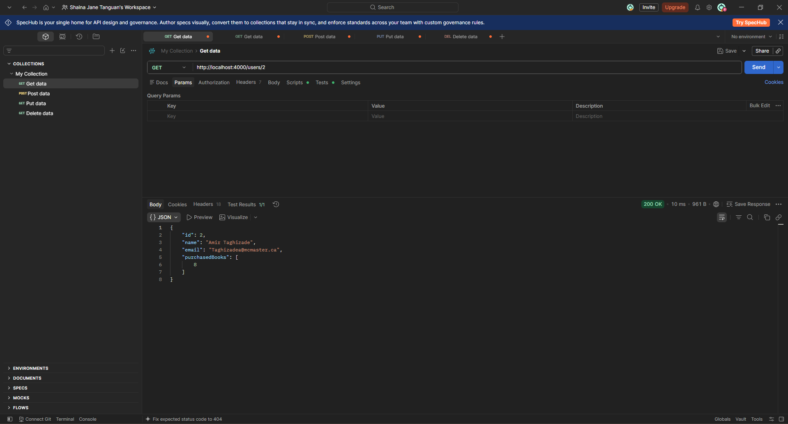
