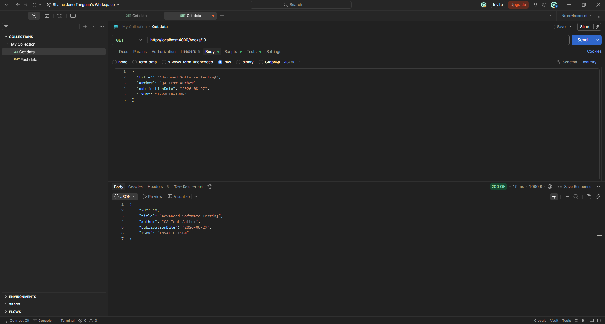

# TC-B007 Update Book Using Invalid Data

**Description:  
**The PUT /books/{10} endpoint accepts an invalid ISBN format when updating an existing book. The API returns 200 OK and stores the invalid ISBN instead of rejecting the request.

The behavior is inconsistent with the POST /books endpoint, which rejects an invalid ISBN format with 400 Bad Request.

## **Key Functionalities**

- Update an existing book.

- Validate book information during update.

- Validate ISBN format.

- Prevent invalid book data from being stored.

- Maintain consistent validation between create and update operations.

## **Expected Result**

The API should reject the update request when an invalid ISBN format is provided. When "ISBN": "INVALID-ISBN" is submitted, the API should return an appropriate validation response, such as 400 Bad Request, and the invalid ISBN should not be stored.

## **Actual Result**

The API returned 200 OK and accepted "INVALID-ISBN" when updating book ID 10. A subsequent retrieval of the book confirmed that the invalid ISBN was stored.

## **Status: Open**
