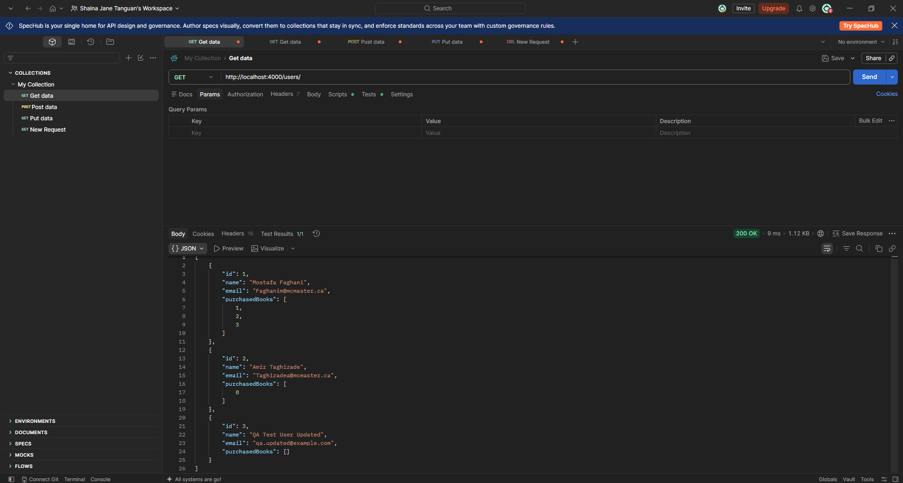
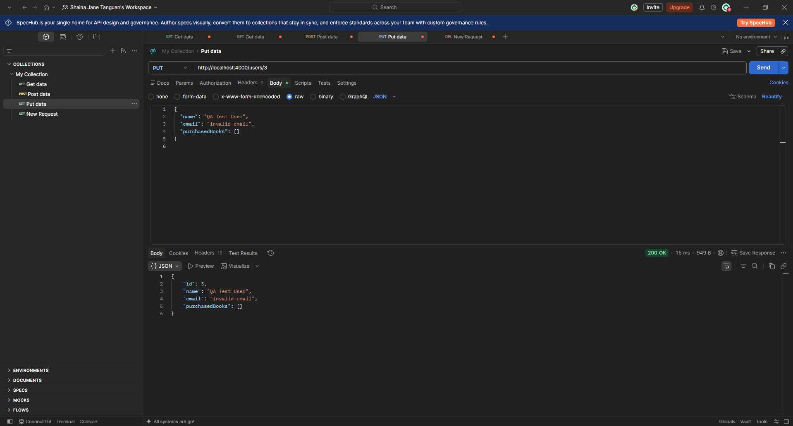

# TC-UPDUSER-U006 Update User With Invalid Email

**Description:  
** Verify that the Users API rejects an update containing an invalid email format through PUT /users/{id}.

**Key Functionalities:**

- Validate the email format during updates.

- Reject invalid email values.

- Return an appropriate validation error and HTTP status code.

- Preserve existing user information when validation fails.

**Expected Result:  
** The API should return 400 Bad Request with an email validation error. The existing user information, including the valid email address, should remain unchanged.

**Actual Result:  
** The API returned 200 OK instead of 400 Bad Request when an invalid email address was submitted in the update request.

Status: Open
