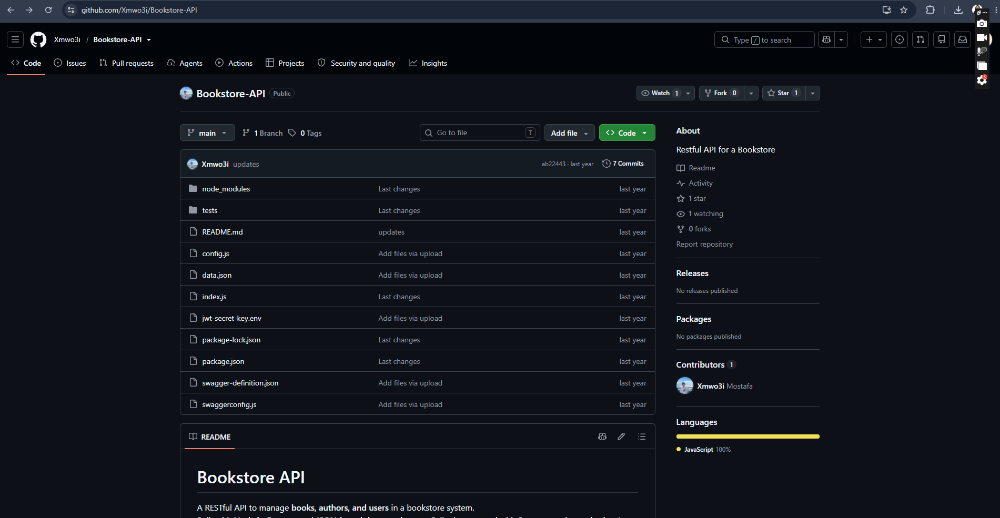

# PEN-OBS-001 Exposed JWT Secret

** Description:  
During penetration testing preparation, a review of the repository structure revealed that a file named jwt-secret-key.env is committed directly to the GitHub repository, exposing the application's JWT signing secret in version control.  
Key Functionalities:

- Review repository contents for exposed credentials or secrets.

- Assess impact of publicly accessible signing keys.

**Expected Result:**  
Sensitive credentials such as JWT secrets should never be committed to version control; they should be excluded via .gitignore and managed through environment variables or a secrets manager.

**Actual Result:**  
The jwt-secret-key.env file is present in the public repository and is accessible to anyone who clones it. This means an attacker could use the exposed secret to forge valid JWT tokens and potentially bypass authentication, depending on how the application uses the token.

Severity: **High  
** Type: Sensitive Data Exposure / Credential Management  
**  
**

Status: **Open**
