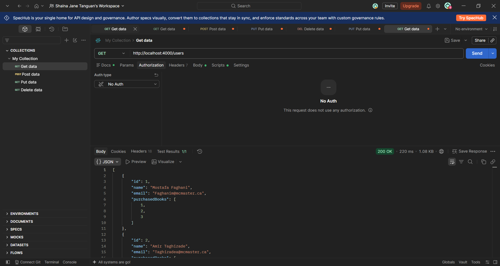
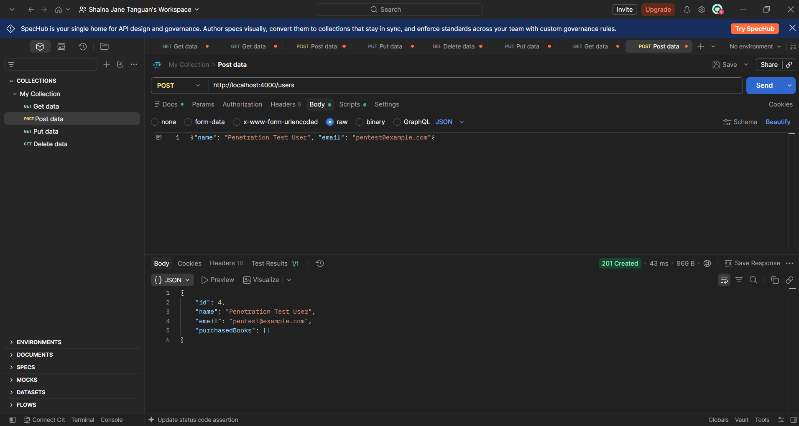
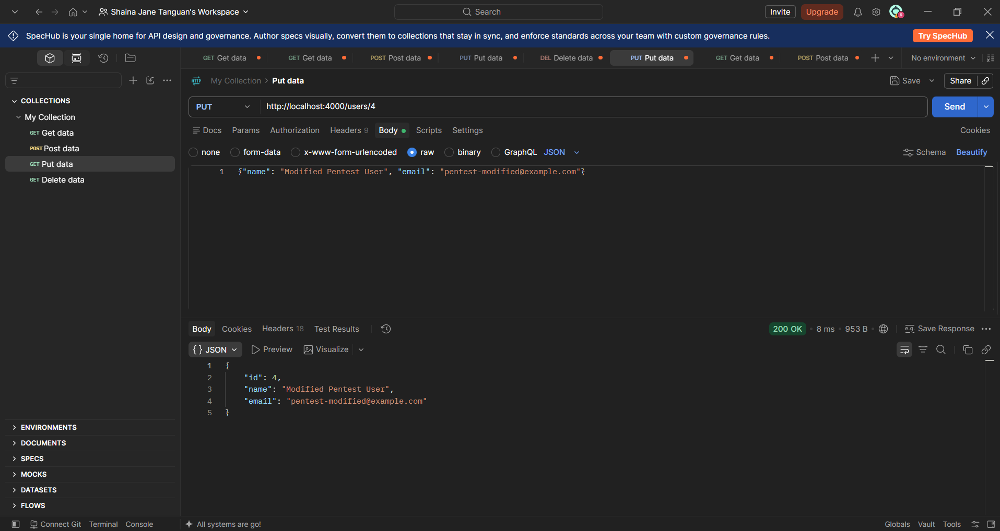
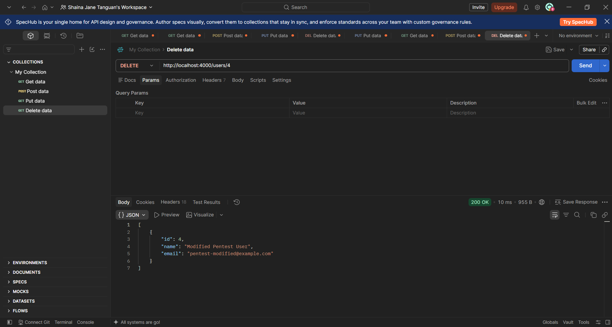

# TC-PEN-001 Access Without Authentication

**Description:**

Verify whether user records exposed by the Users API can be accessed, created, modified, and deleted through GET, POST, PUT, and DELETE on /users without any authentication or authorization.

**Key Functionalities:**

> ● Access user records without credentials.
>
> ● Create a new user record without credentials.
>
> ● Modify an existing user record without credentials.
>
> ● Delete a user record without credentials.

**Expected Result:**

If the endpoints are intended to be protected, the API should return 401 Unauthorized or 403 Forbidden and should not expose or modify records. If authentication is outside the repository's intended scope, unrestricted access should be documented as a security limitation rather than a confirmed defect.

**Actual Result:**

Executed manually via Postman with no Authorization header present. GET /users returned 200 OK with the full user list. POST /users returned 201 Created, generating a new user record (id 4). PUT /users/4 returned 200 OK and successfully updated the record. DELETE /users/4 returned 200 OK and removed the record. All four operations completed successfully with zero credentials supplied — the API enforces no authentication on any /users route.

Status: Passed
