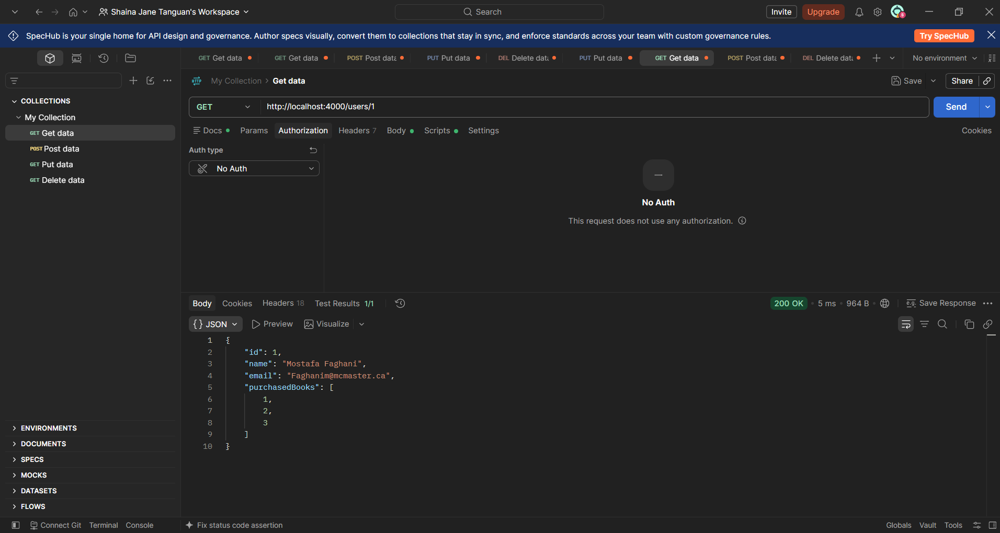

# TC-PEN-002 Access Another User

**Description:**

Determine whether changing the ID in the request path allows access to another user's record without authorization.

**Key Functionalities:**

> ● Retrieve a specific user record by ID.
>
> ● Retrieve a different user's record by changing only the ID.
>
> ● Check whether an authorization boundary exists between users.

**Expected Result:**

In an authenticated system, a user should not be able to access another user's protected record without permission — the API should return 403 Forbidden or 404 Not Found. If the project intentionally has no user ownership or authentication model, the result should be marked Not Applicable.

**Actual Result:**

GET /users/1 returned 200 OK with the first user's full record, and GET /users/2 returned 200 OK with the second user's full record, with no restriction applied. This is a direct consequence of the finding in TC-PEN-001: the API has no session, ownership, or authentication concept at all, so there is no access boundary to bypass. Recorded as Not Applicable rather than a separate IDOR defect.

Status: Passed
