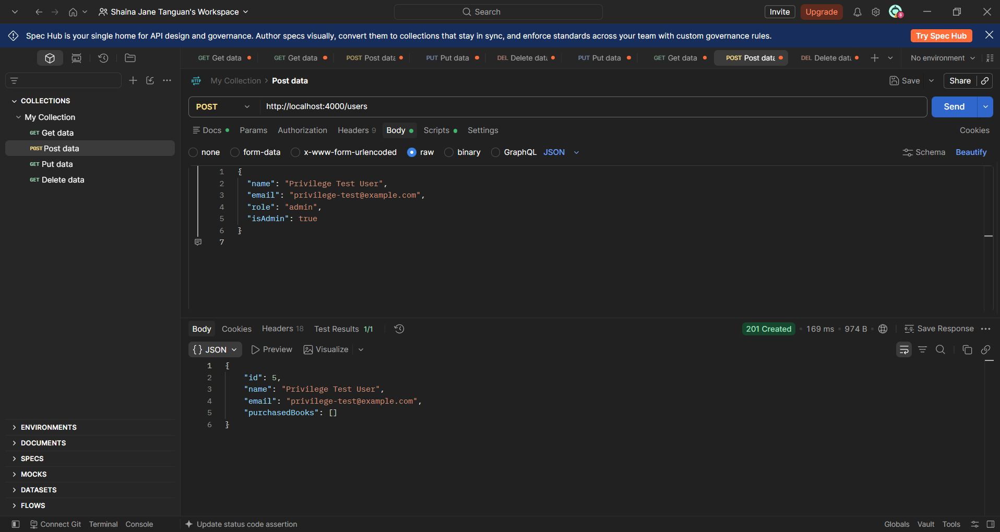
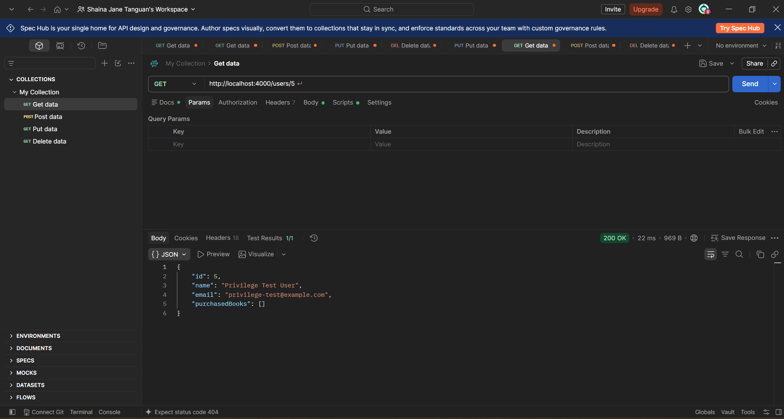
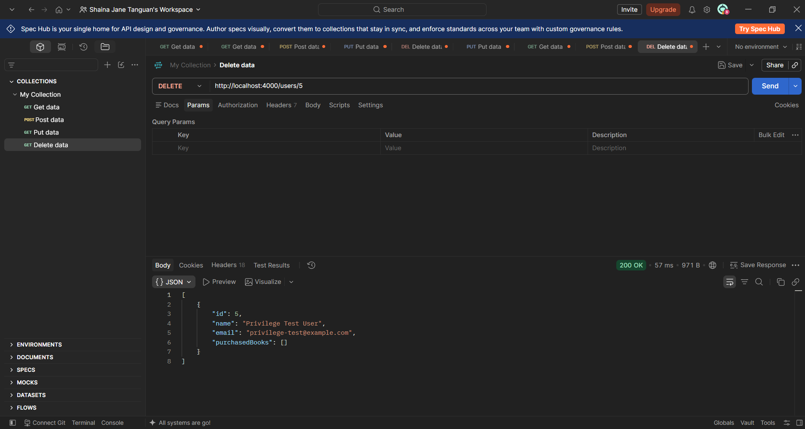

# TC-PEN-003 Submit Unexpected Privileged Fields

**Description:**

Determine whether the API accepts unexpected security-sensitive fields, such as role and isAdmin, during user creation.

**Key Functionalities:**

> ● Submit privileged fields (role, isAdmin) in a user creation request.
>
> ● Verify whether the privileged fields are stored.
>
> ● Confirm no privilege escalation occurs as a result.

**Expected Result:**

The API should reject or ignore unexpected privileged properties. The fields must not grant administrative privileges or modify the intended user structure.

**Actual Result:**

POST /users was sent with role: "admin" and isAdmin: true included in the body. The API returned 201 Created, but the response body contained only id, name, email, and purchasedBooks — role and isAdmin were not present. A follow-up GET /users/3 confirmed neither field had been persisted. The disposable record was deleted after verification.

Status: Passed
