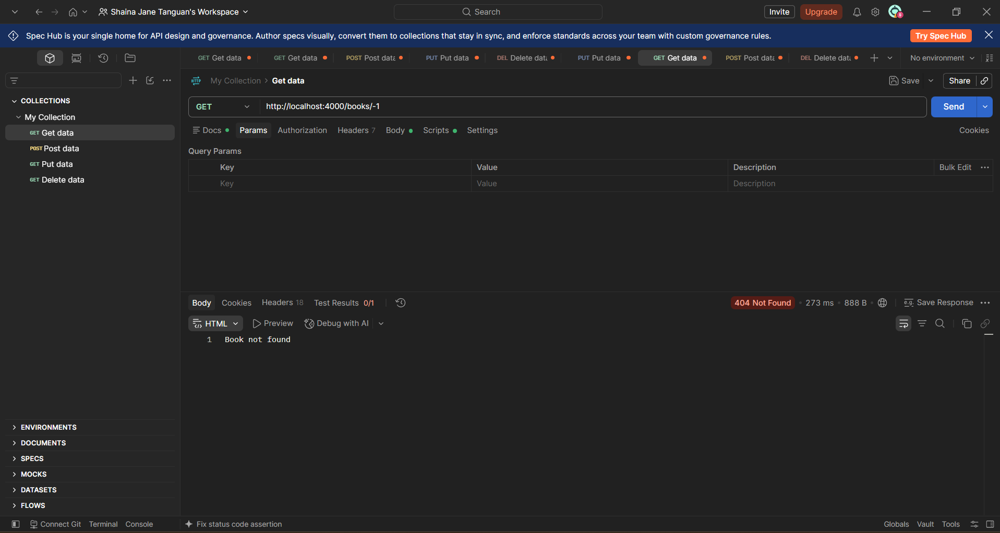
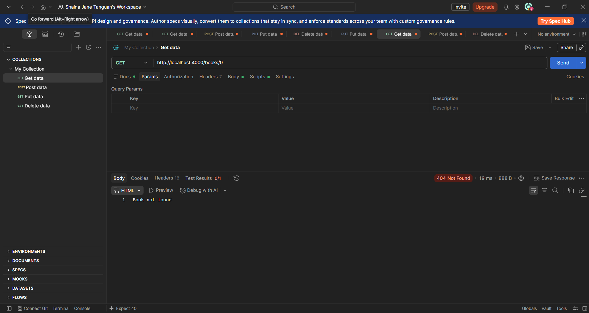
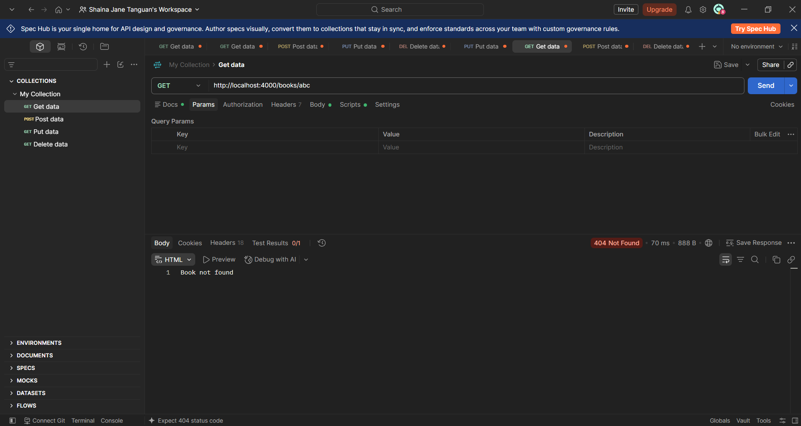
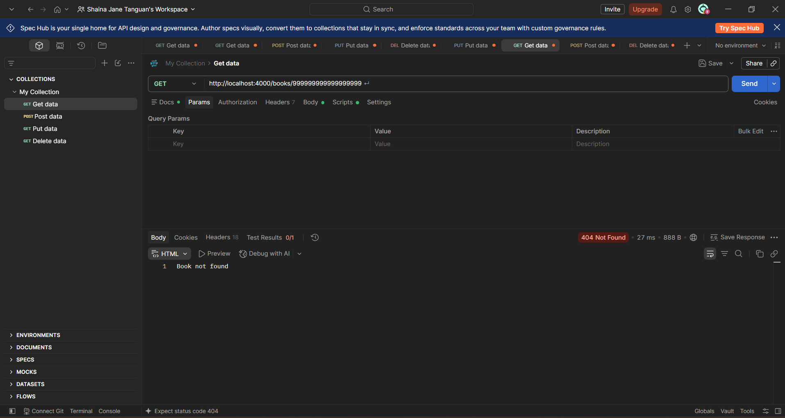

# TC-PEN-004 Manipulate Resource IDs

## **Description:**

## Verify that negative, zero, alphabetic, and extremely large IDs are handled safely by the Books API.

## **Key Functionalities:**

## ● Request a book record using a negative ID.

## ● Request a book record using a zero or non-numeric ID.

## ● Request a book record using an extremely large ID.

## ● Confirm the API remains stable and responsive afterward.

## **Expected Result:**

## The API should return a controlled 400 Bad Request or 404 Not Found. It should not crash, return an unrelated record, or expose internal server information.

## **Actual Result:**

## GET /books/-1, /books/0, /books/abc, and /books/999999999999999999 each returned 404 Not Found with the plain-text message "Book not found." No 500 errors, stack traces, or internal details were exposed. A follow-up GET /books returned 200 OK, confirming the server remained fully responsive.

## 

Status: Passed
