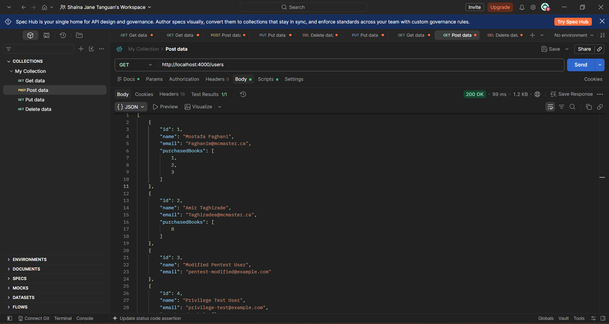
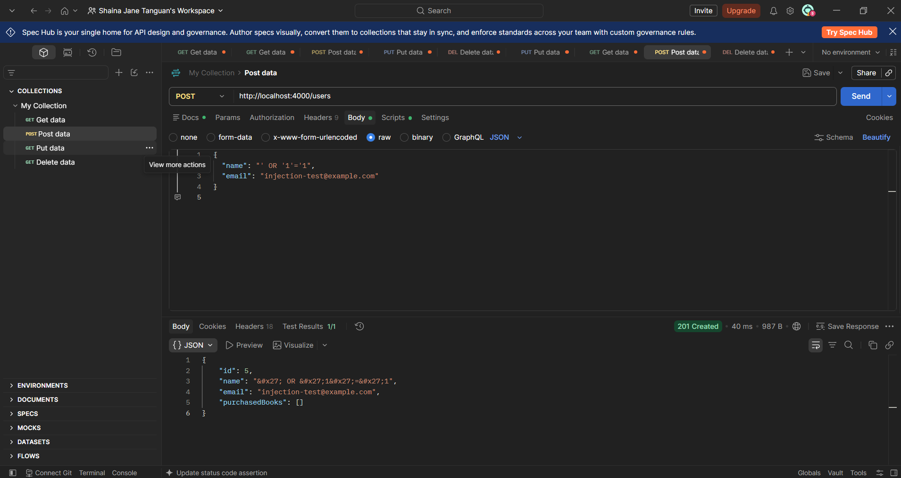
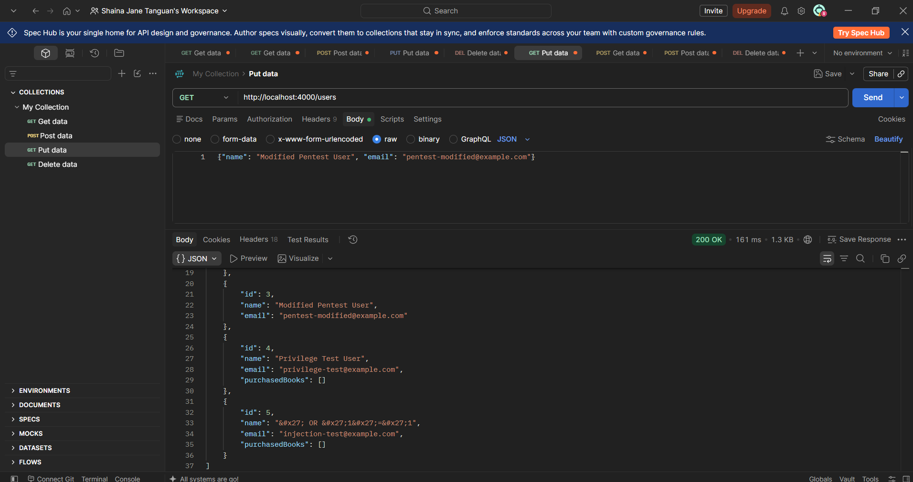
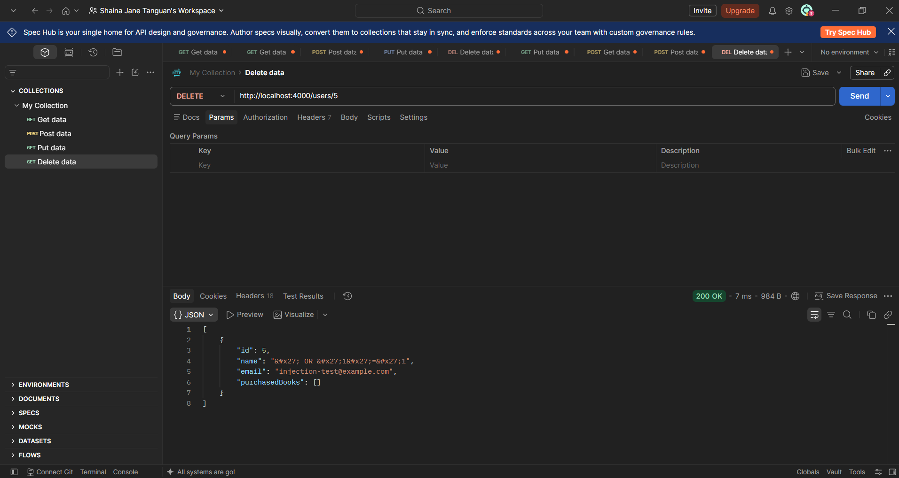

# TC-PEN-005 Submit Injection Like Payload

**Description:**

Determine whether injection-like input can alter the intended API behavior, expose records, or cause an internal server error.

**Key Functionalities:**

> ● Submit a SQL-injection-style string in a user field.
>
> ● Verify the payload is not executed or interpreted as code.
>
> ● Confirm no unrelated records are exposed, modified, or deleted.

**Expected Result:**

The input should be rejected by validation or handled only as ordinary text. It must not bypass access controls, expose unrelated data, modify other records, or cause an internal server error.

**Actual Result:**

POST /users was sent with name: "' OR '1'='1" and a disposable email. The API returned 201 Created, with the name stored as HTML-escaped, inert text (&#x27; OR &#x27;1&#x27;=&#x27;1). A follow-up GET /users showed only the new escaped record had been added — no unrelated records were exposed, changed, or removed, and no server error occurred. The disposable record was deleted after verification.

Status: Passed
