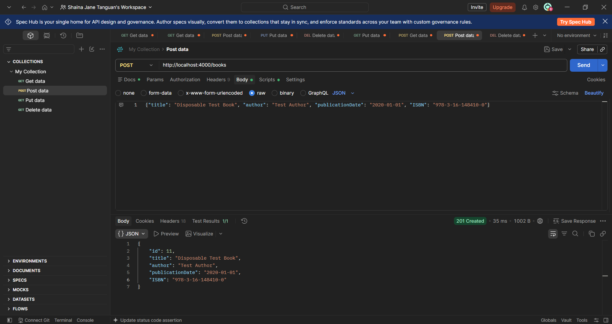
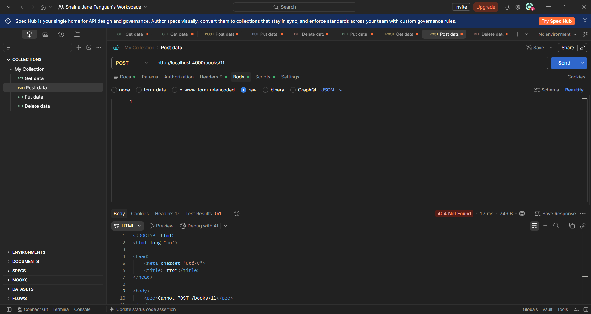
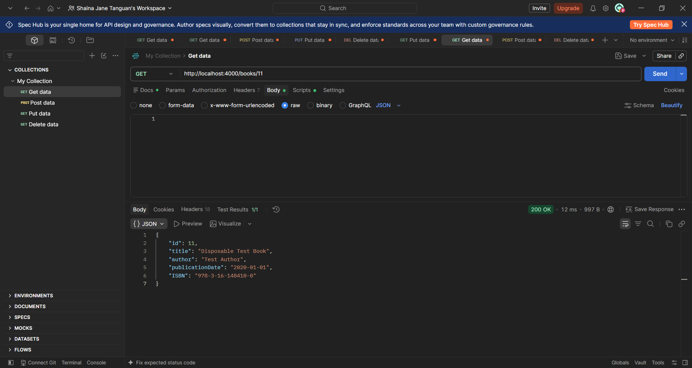

# TC-PEN-006 Attempt HTTP Method Override

**Description:**

Determine whether an HTTP method override header can cause an unintended deletion.

**Key Functionalities:**

> ● Create a disposable book record.
>
> ● Send a POST request with an X-HTTP-Method-Override: DELETE header.
>
> ● Confirm the record was not deleted or modified.

**Expected Result:**

The unsupported POST request should be rejected. The override header should not delete or modify the book.

**Actual Result:**

A disposable book was created via POST /books (id 10). Sending POST /books/10 with header X-HTTP-Method-Override: DELETE returned 404 Not Found with "Cannot POST /books/10" — no route exists for POST on that path, so the override header had no effect. A follow-up GET /books/10 confirmed the record was unchanged. The book was then removed with a genuine DELETE request for cleanup.

Status: Passed
