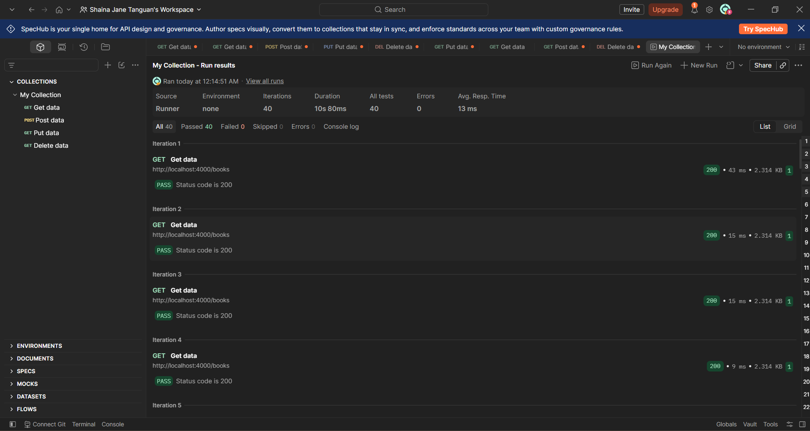
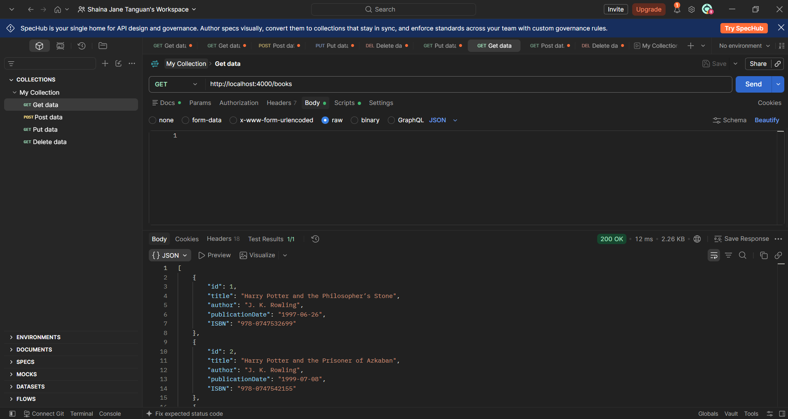

# TC-PEN-007 Send Repeated Requests

**Description:**

Determine whether the API remains stable when it receives repeated requests and whether basic rate limiting is implemented.

**Key Functionalities:**

> ● Send a batch of repeated GET requests to the same endpoint.
>
> ● Record the returned status codes across all requests.
>
> ● Confirm the API remains responsive after the batch completes.

**Expected Result:**

The API should remain stable and responsive. Ideally, excessive requests should be controlled with 429 Too Many Requests. If no rate limiting exists, it should be recorded as a security observation.

**Actual Result:**

GET /books was run 40 times via Postman's Collection Runner with a short delay between requests. All 40 iterations returned 200 OK, with zero occurrences of 429. A follow-up manual GET /books returned 200 OK, confirming the server remained stable and responsive throughout. No rate limiting is implemented — recorded as a security observation rather than a functional defect.

Status: Passed
