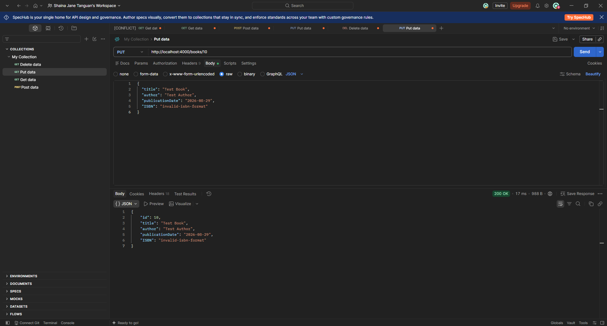

# TC-B007 Update Book With Invalid ISBN Regression

**  
Description:**  
Re-verify whether the Books API correctly rejects an update containing an invalid ISBN format through PUT /books/{id}.  
**Key Functionalities:**

- Validate ISBN format during updates.

- Reject invalid ISBN values.

- Return an appropriate validation error and HTTP status code.

**Expected Result:**  
The API should return 400 Bad Request with an ISBN validation error, and existing book information should remain unchanged.

**Actual Result:**  
The API returned 200 OK and saved the invalid ISBN ("invalid-isbn-format") on a freshly created book record, identical to the original defect.

Status: Failed
