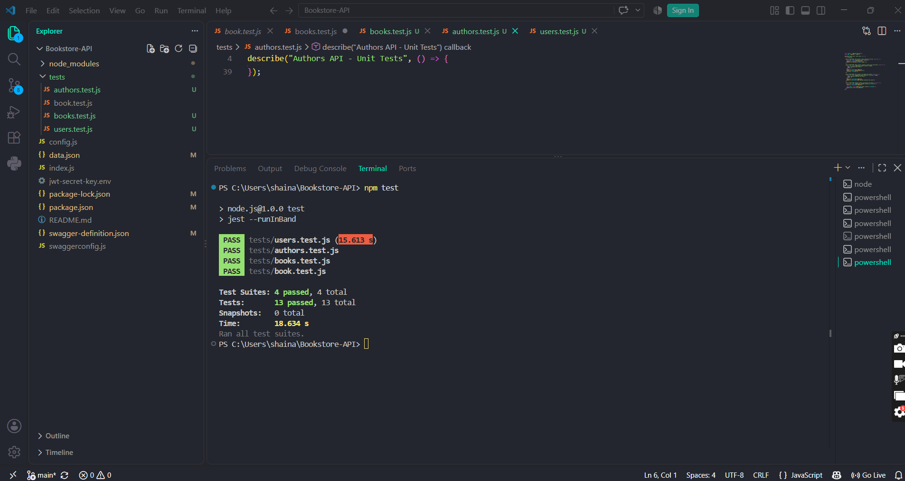

# TC-RETBOOKS-B001 Retrieve All Books Regression

**Description:**  
Re-verify that the Books API successfully retrieves all available book records through the GET /books endpoint, following completion of the full testing cycle.  
**Key Functionalities:**

- Retrieve all book records.

- Return book information in JSON format.

- Return the appropriate HTTP status code.

**Expected Result:**  
The API should return 200 OK and provide the available books in JSON format, consistent with original execution.

**Actual Result:**  
Re-executed via automated Jest/Supertest suite. Returned 200 OK with an array of book records, matching original result.

Status: Passed
