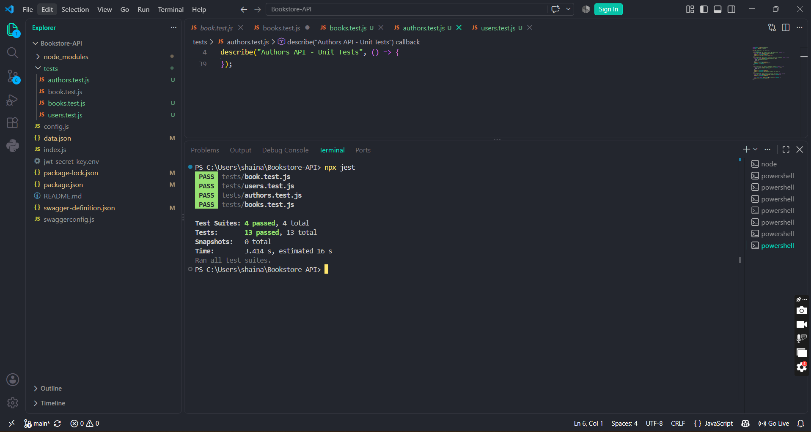

# TC-UNIT-B001 to B004 Automated Regression

** Description:  
Re-execute the full automated unit/integration test suite for Books to confirm CRUD functionality remains stable.  
Key Functionalities:

- Re-validate GET, POST, PUT, DELETE for /books.

- Confirm no regressions introduced since original execution.  
  > Expected Result:  
  > All 4 automated Books test cases should continue to pass with no change in behavior.  
  > Actual Result:  
  > All 4 test cases passed on re-execution via jest --runInBand, matching original results exactly.

Status: Passed

**TC-UNIT-A001–A004 – Authors Automated Regression Coverage  
** Description:  
Re-execute the full automated unit/integration test suite for Authors to confirm CRUD functionality remains stable.  
Key Functionalities:

- Re-validate GET, POST, PUT, DELETE for /authors.

- Confirm no regressions introduced since original execution.  
  > Expected Result:  
  > All 4 automated Authors test cases should continue to pass with no change in behavior.  
  > Actual Result:  
  > All 4 test cases passed on re-execution via jest --runInBand, matching original results exactly.

Status: Passed

**TC-UNIT-U001–U004 – Users Automated Regression Coverage  
** Description:  
Re-execute the full automated unit/integration test suite for Users to confirm CRUD functionality remains stable.  
Key Functionalities:

- Re-validate GET, POST, PUT, DELETE for /users.

- Confirm no regressions introduced since original execution.  
  > Expected Result:  
  > All 4 automated Users test cases should continue to pass with no change in behavior.  
  > Actual Result:  
  > All 4 test cases passed on re-execution via jest --runInBand, matching original results exactly.

Status: Passed

**OBS-001 – Concurrency Behavior Under Repeated Load  
** Description:  
Re-verify whether concurrent access to the shared JSON data file still produces intermittent errors when the automated test suite runs in default parallel mode.  
Key Functionalities:

- Execute test suite without --runInBand (parallel mode).

- Observe whether concurrent reads/writes to the shared data file produce errors.  
  > Expected Result:  
  > N/A — observational check due to the timing-dependent, non-deterministic nature of the issue.  
  > Actual Result:  
  > Suite passed cleanly (13/13) on this run in parallel mode, unlike the original execution which produced intermittent 500 errors under the same conditions. The inconsistency between runs supports the original diagnosis of a race condition tied to concurrent file access, rather than a stable, always-reproducible bug.

Status: Passed with Observation Noted

