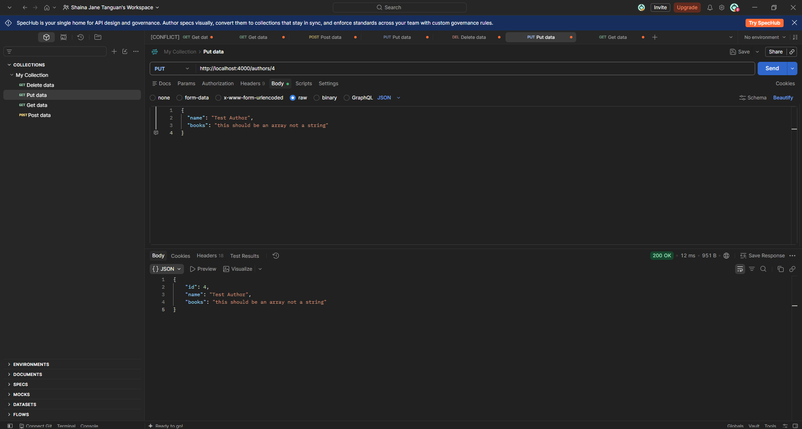

# TC-UPDAUTH-A007 Update Author Regression

**  
Description:**  
Re-verify whether the Authors API correctly rejects an update when books is supplied as a string instead of an array through PUT /authors/{id}.  
**Key Functionalities:**

- Validate that books is an array.

- Reject non-array books values.

- Return an appropriate validation error and HTTP status code.

**Expected Result:**  
The API should return 400 Bad Request with a type validation error, and existing author information should remain unchanged.

**Actual Result:**  
The API returned 200 OK and saved books as a string value, identical to the original defect.

Status: Failed
