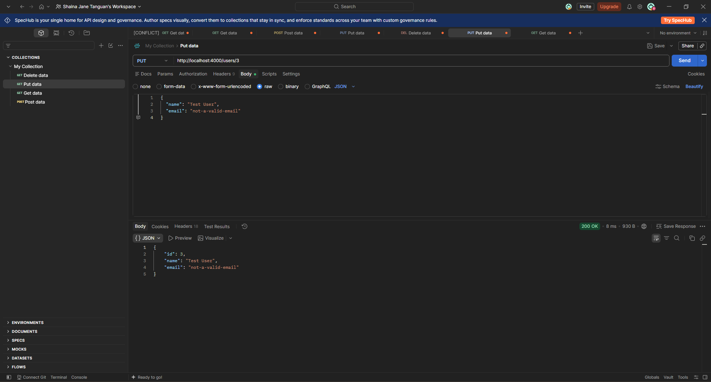

# TC-UPDUSER-U006 Update User Regression

**  
Description:**  
Re-verify whether the Users API correctly rejects an update containing an invalid email format through PUT /users/{id}.

**Key Functionalities:**

- Validate email format during updates.

- Reject invalid email values.

- Return an appropriate validation error and HTTP status code.

**Expected Result:**  
The API should return 400 Bad Request with an email validation error, and existing user information should remain unchanged.

**Actual Result:**  
The API returned 200 OK and saved the invalid email ("not-a-valid-email"), identical to the original defect.

Status: Failed
