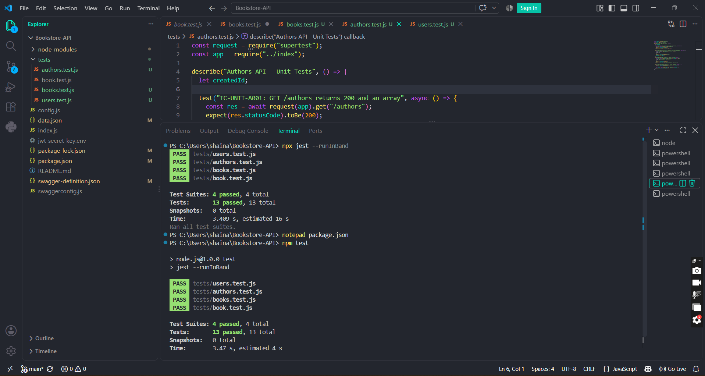
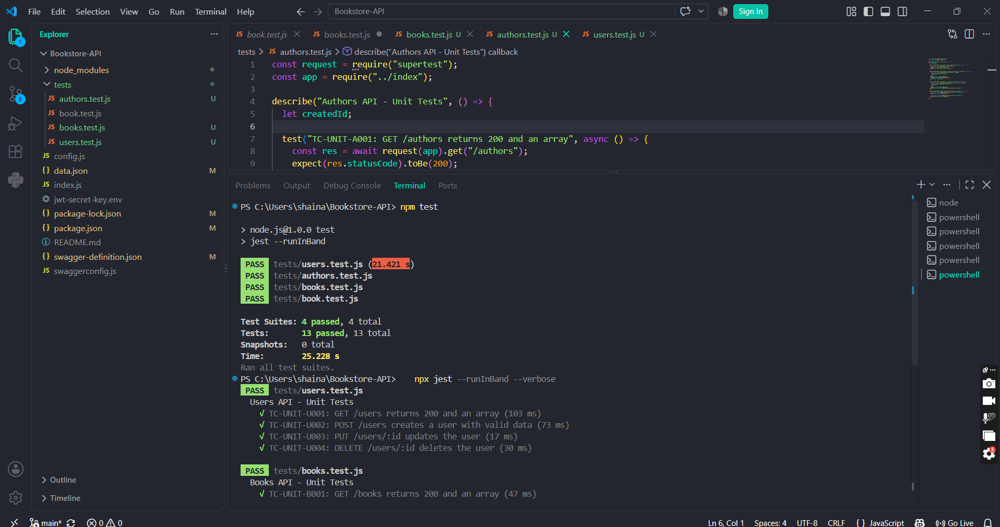
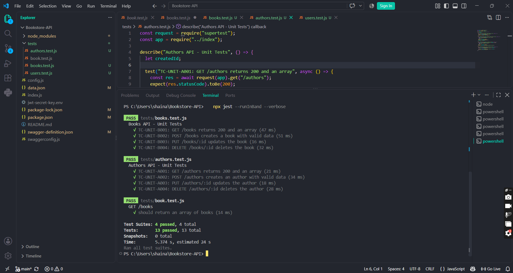

# Unit Testing Findings

**TC-UNIT-001 – Retrieve All Books (Unit)  
** Description: Verify that the Books endpoint returns a successful response containing an array, using an automated Jest/Supertest unit test.

**Key Functionalities:**

- Send an automated GET request to /books

- Assert response status is 200

- Assert response body is an array  
  > Expected Result: The endpoint returns 200 OK, and the response body is an array of book records.  
  > Actual Result: Automated test executed via Jest/Supertest. Response returned status 200 with an array body, matching expected result.  
  > Status: **Passed**

**TC-UNIT-B001 – Retrieve All Books  
** Description: Verify that the Books endpoint returns a successful response containing an array through an automated unit/integration test.

**Key Functionalities:**

- Import the application and Supertest

- Send a GET request to /books

- Assert response status is 200

- Assert response body is an array  
  > Expected Result: The endpoint returns 200 OK, and the response body is an array of book records.  
  > Actual Result: Automated Jest/Supertest test executed successfully. GET /books returned status 200 with an array response body.  
  > Status: **Passed**

**TC-UNIT-B002 – Create a Book Using Valid Data  
** Description: Verify that valid book information creates a new book through an automated unit/integration test.  
Key Functionalities:

- Send a POST request to /books with a valid payload

- Assert the documented successful creation status

- Assert the response contains a generated ID

- Assert returned values match submitted values  
  > Expected Result: The API creates a book and returns the documented success status, a generated ID, and the submitted book information.  
  > Actual Result: Automated test executed successfully. POST /books returned status 201 with a generated ID, and returned values matched the submitted payload.  
  > Status: **Passed**

**TC-UNIT-B003 – Update an Existing Book  
** Description: Verify that valid information updates an existing book through an automated unit/integration test.

**Key Functionalities:**

- Create a disposable book during setup

- Send a PUT request to /books/{id} with a valid update payload

- Assert response status is 200 and ID is unchanged

- Verify the update was saved  
  > Expected Result: The API returns 200 OK, retains the same book ID, and saves the updated information.  
  > Actual Result: Automated test executed successfully. PUT /books/{id} returned status 200, retained the original ID, and the title field reflected the update.  
  > Status: **Passed**

**TC-UNIT-B004 – Delete an Existing Book  
** Description: Verify that an existing disposable book can be deleted through an automated unit/integration test.

**Key Functionalities:**

- Create a disposable book during setup

- Send a DELETE request to /books/{id}

- Assert response status is 200

- Assert a subsequent GET on the deleted ID returns 404  
  > Expected Result: The API deletes the book successfully, and the deleted record can no longer be retrieved.  
  > Actual Result: Automated test executed successfully. DELETE /books/{id} returned status 200, and the follow-up GET request returned 404 as expected.  
  > Status: **Passed**

**TC-UNIT-A001 – Retrieve All Authors  
** Description: Verify that the Authors endpoint returns an array through an automated unit/integration test.  
Key Functionalities:

- Send a GET request to /authors

- Assert response status is 200

- Assert response body is an array  
  > Expected Result: The endpoint returns 200 OK, and the response body is an array of author records.  
  > Actual Result: Automated test executed successfully. GET /authors returned status 200 with an array response body.  
  > Status: **Passed**

**TC-UNIT-A002 – Create an Author Using Valid Data  
** Description: Verify that valid author information creates a new author through an automated unit/integration test.

**Key Functionalities:**

- Send a POST request to /authors with a valid payload

- Assert the documented successful creation status

- Assert response contains a generated ID and matches payload  
  > Expected Result: The API creates a new author and returns the documented success status, generated ID, and submitted author information.  
  > Actual Result: Automated test executed successfully. POST /authors returned status 201 with a generated ID, and returned values matched the submitted payload.  
  > Status: **Passed**

**TC-UNIT-A003 – Update an Existing Author  
** Description: Verify that valid information updates an existing author through an automated unit/integration test.

**Key Functionalities:**

- Create a disposable author during setup

- Send a PUT request to /authors/{id} with a valid update payload

- Assert response status is 200 and ID is unchanged

- Verify the update was saved  
  > Expected Result: The API returns 200 OK, retains the same author ID, and saves the updated information.  
  > Actual Result: Automated test executed successfully. PUT /authors/{id} returned status 200, retained the original ID, and the name field reflected the update.  
  > Status: **Passed**

**TC-UNIT-A004 – Delete an Existing Author  
** Description: Verify that an existing disposable author can be deleted through an automated unit/integration test.

**Key Functionalities:**

- Create a disposable author during setup

- Send a DELETE request to /authors/{id}

- Assert response status is 200

- Assert a subsequent GET on the deleted ID returns 404  
  > Expected Result: The API deletes the author successfully, and the record can no longer be retrieved.  
  > Actual Result: Automated test executed successfully. DELETE /authors/{id} returned status 200, and the follow-up GET request returned 404 as expected.  
  > Status: **Passed**

**TC-UNIT-U001 – Retrieve All Users  
** Description: Verify that the Users endpoint returns an array through an automated unit/integration test.

**Key Functionalities:**

- Send a GET request to /users

- Assert response status is 200

- Assert response body is an array  
  > Expected Result: The endpoint returns 200 OK, and the response body is an array of user records.  
  > Actual Result: Automated test executed successfully. GET /users returned status 200 with an array response body.  
  > Status: **Passed**

**TC-UNIT-U002 – Create a User Using Valid Data  
** Description: Verify that valid user information creates a new user through an automated unit/integration test.

**Key Functionalities:**

- Send a POST request to /users with a valid payload

- Assert the documented successful creation status

- Assert response contains a generated ID and matches payload  
  > Expected Result: The API creates a new user and returns the documented success status, generated ID, and submitted user information.  
  > Actual Result: Automated test executed successfully. POST /users returned status 201 with a generated ID, and returned values matched the submitted payload.  
  > Status: **Passed**

**TC-UNIT-U003 – Update an Existing User  
** Description: Verify that valid information updates an existing user through an automated unit/integration test.  
Key Functionalities:

- Create a disposable user during setup

- Send a PUT request to /users/{id} with a valid update payload

- Assert response status is 200 and ID is unchanged

- Verify the update was saved  
  > Expected Result: The API returns 200 OK, retains the same user ID, and saves the updated user information.  
  > Actual Result: Automated test executed successfully. PUT /users/{id} returned status 200, retained the original ID, and the name/email fields reflected the update.  
  > Status: **Passed**

**TC-UNIT-U004 – Delete an Existing User  
** Description: Verify that an existing disposable user can be deleted through an automated unit/integration test.

**Key Functionalities:**

- Create a disposable user during setup

- Send a DELETE request to /users/{id}

- Assert response status is 200

- Assert a subsequent GET on the deleted ID returns 404  
  > Expected Result: The API deletes the user successfully, and the deleted record can no longer be retrieved.  
  > Actual Result: Automated test executed successfully. DELETE /users/{id} returned status 200, and the follow-up GET request returned 404 as expected.  
  > Status: **Passed**

